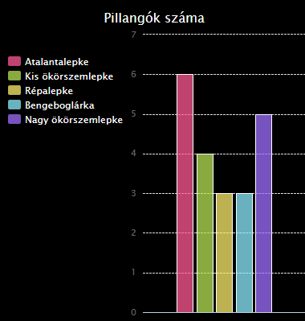

\--- challenge \---

## Kihívás: Készíts új diagramot egy fájlból

Tudsz új oszlopdiagramot és kördiagramot létrehozni adatból egy fájlban? Új .txt fájlt kell létrehoznod.

Tipp: Ha szeretnél szóközöket a címkékben, akkor használd a `line.split (': ')` kódot, és adj kettőspontokat az adatfájlhoz, pl. „Kis ökörszemlepke: 4”

\--- /challenge \---