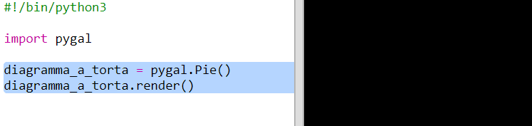
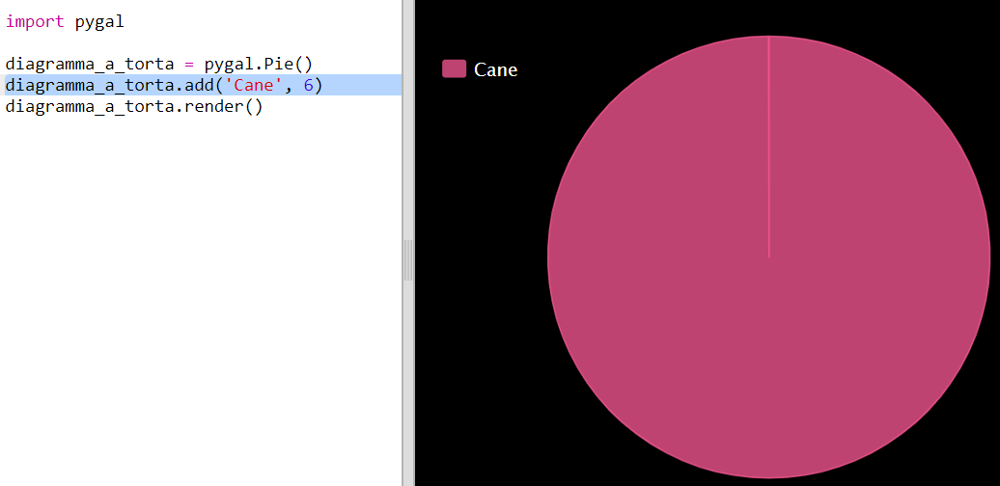
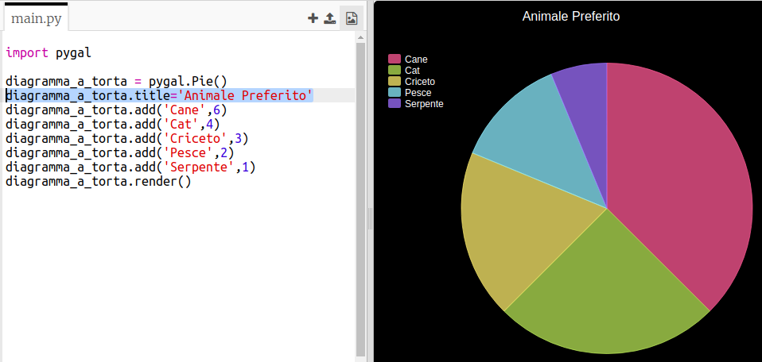
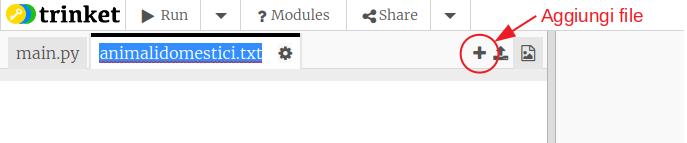
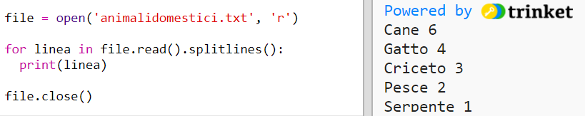
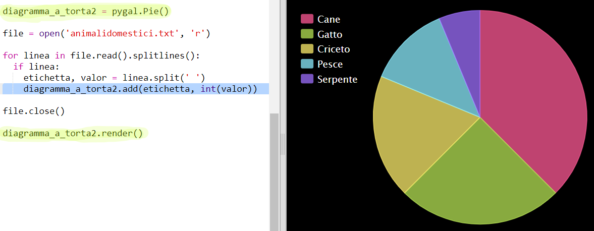

# Introduzione {.intro}

In questo progetto avrai la possibilità di creare grafici a torta e grafici a barre dai dati raccolti dai membri del tuo Code Club.

  <iframe src="https://trinket.io/embed/python/70d24d92b8?outputOnly=true&start=result" width="600" height="500" frameborder="0" marginwidth="0" marginheight="0" allowfullscreen>
  </iframe>
  

# Passaggio 1: creare un grafico a torta {.activity}

I grafici a torta sono un modo utile per mostrare i dati. Possiamo creare un sondaggio sugli animali domestici preferiti nel tuo Code Club e presentare i dati in un grafico a torta.

## Lista di controllo delle attività {.check}

+ Chiedi al volontario di aiutarti a organizzare un sondaggio. È possibile registrare i risultati su un computer collegato a un proiettore o una lavagna visibile a tutti.
    
    Scrivi un elenco di animali domestici e assicurati che il preferito di tutti sia incluso.
    
    Quindi fai in modo che tutti votino per il loro preferito alzando la mano quando viene chiamato. Solo un voto ciascuno!
    
    Per esempio:
    
    

+ Apri un modello vuoto di Python su Trinket: <a href="http://jumpto.cc/python-new" target="_blank">jumpto.cc/python-new</a>.

+ Creiamo un grafico a torta per mostrare i risultati del sondaggio. La libreria PyGal ti sarà utile nella parte più faticosa del lavoro.
    
    Prima importa la libreria Pygal:
    
    

+ Ora puoi creare un grafico a torta e renderizziamolo (visualizza):
    
    
    
    Non preoccuparti, sarà più interessante una volta che aggiungerai i dati!

+ Aggiungiamo i dati per uno degli animali domestici. Puoi utilizzare i dati che hai raccolto.
    
    
    
    C'è solo un dato e quindi occupa l'intero grafico a torta.

+ Ora aggiungi il resto dei dati nello stesso modo.
    
    Per esempio:
    
    

+ E per finire il tuo grafico, aggiungi un titolo:
    
    

## Salva il tuo progetto {.save}

## Sfida: crea il tuo grafico a barre {.challenge}

È possibile creare grafici a barre in modo simile. Basta usare `barchart = pygal.Bar ()` per creare un nuovo grafico a barre, quindi aggiungere dati e renderizzare come per un grafico a torta.

Raccogli i dati dai membri del tuo Code Club per creare il tuo grafico a barre.

Assicurati di scegliere un argomento che tutti conoscono!

Ecco alcune idee:

+ Qual è il vostro sport preferito?

+ Qual è il tuo gusto preferito di gelato?

+ Con che mezzo vai a scuola?

+ In quale mese è il tuo compleanno?

+ Giochi a Minecraft? (si /no)

Non fare domande che richiedono dati personali come dove vivono le persone. Chiedi al tuo capo club se non sei sicuro.

Esempi:

## Salva il tuo progetto {.save}

# Passaggio 2: leggere i dati da un file {.activity}

È utile poter archiviare i dati in un file piuttosto che doverli includere nel codice.

## Lista di controllo delle attività {.check}

+ Aggiungi un nuovo file al tuo progetto e salvalo come `animalidomestici.txt`:
    
    

+ Ora aggiungi i dati al file. Puoi utilizzare i dati sugli animali domestici preferiti raccolti o i dati di esempio.
    
    

+ Torna a `main.py` e commenta le righe che renderizzeranno (visualizzano) diagrammi e grafici (in modo che non vengano visualizzati):
    
    

+ Ora leggiamo i dati dal file.
    
    
    
    Il ciclo `for` passerà sopra le righe nel file. `splitlines()` rimuove il carattere di nuova riga dalla fine della linea poiché non serve.

+ Ciascuna riga deve essere separata in un'etichetta e un valore:
    
    
    
    Questo dividerà la linea negli spazi in modo tale da non includere spazi nelle etichette. (È possibile aggiungere il supporto per gli spazi nelle etichette in un momento successivo.)

+ Potresti ottenere un errore di questo tipo:
    
    
    
    Questo succede se hai una riga vuota alla fine del tuo file.
    
    È possibile correggere l'errore ottenendo l'etichetta e il valore solo se la riga non è vuota.
    
    Per fare ciò, rientra il codice all'interno del tuo ciclo `for` e aggiungi il codice `if line:` sopra di esso:
    
    

+ Puoi rimuovere la riga `print(label, value)` e ora tutto funzionerà.

+ Adesso aggiungiamo l'etichetta e il valore a un nuovo grafico a torta e renderizziamolo:
    
    
    
    Nota che `add` si aspetta che il valore sia un numero, `int(value)` trasforma il valore da una stringa a un numero intero.
    
    Se volessi utilizzare i numeri decimali come ad esempio 3.5 (numeri in virgola mobile) potresti usare `float(value)`.

## Salva il tuo progetto {.save}

## Sfida: Crea un nuovo grafico da un file {.challenge}

Riesci a creare un nuovo grafico a barre o grafico a torta dai dati in un file? Dovrai creare un nuovo file .txt.

Suggerimento: se vuoi avere spazi nelle etichette, usa `line.split (': ')` e aggiungi due punti al tuo file di dati, ad esempio 'Vanessa atalanta: 6'

## Salva il tuo progetto {.save}

## Sfida: più grafici e diagrammi! {.challenge}

Sai come creare un grafico a torta e uno a barre dallo stesso file? Puoi utilizzare i dati raccolti in precedenza o raccogliere alcuni nuovi dati.

## Salva il tuo progetto {.save}