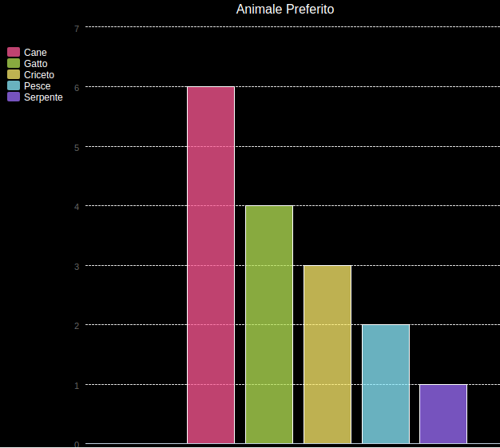

## Introduzione

In questo progetto avrai la possibilità di creare grafici a torta e grafici a barre dai dati raccolti dai membri del tuo Code Club.

### Instructions

When you click Run the charts are generated from data using the PyGal python module.

  <iframe src="https://trinket.io/embed/python/70d24d92b8?outputOnly=true&start=result" width="600" height="500" frameborder="0" marginwidth="0" marginheight="0" allowfullscreen>
  </iframe>
  

### What you will learn

This project covers elements from the following strands of the [Raspberry Pi Digital Making Curriculum](http://rpf.io/curriculum):

+ [Combine programming constructs to solve a problem.](https://www.raspberrypi.org/curriculum/programming/builder/)

### Additional information for educators

If you need to print this project, please use the [printer-friendly version](https://projects.raspberrypi.org/en/projects/popular-pets/print){:target="_blank"}.

Use the link in the footer to access the GitHub repository for this project, which contains all resources (including an example finished project) in the 'en/resources' folder.