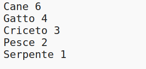
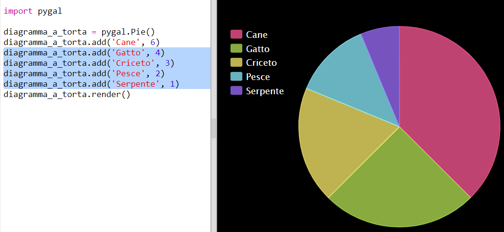

## Crea un Grafico Circolare

I Grafici a Torta sono un metodo utile per mostrare i tuoi dati. Facciamo un sondaggio degli animali preferiti nel tuo Code Club e poi presentiamo i dati con un grafico circolare.

+ Chiedi al tuo volontario di aiutare ad organizzare un sondaggio. Puoi registrare i risultati in un computer collegato a un proiettore o a una lavagna bianca che tutti possono vedere.

  Scrivi una lista di animali e assicurati che venga incluso il preferito di ciascun socio.

  Poi chiedi a tutti di votare per il loro preferito alzando la mano quando viene chiamato. Si vota solo un animale!

  Ad esempio:

  

+ Apri il modello vuoto di Python Trinket: <a href="http://jumpto.cc/python-new" target="_blank">jumpto.cc/python-new</a>.

+ Creiamo un grafico circolare per mostrare i risultati del tuo sondaggio. Userai la libreria PyGal per eseguire il lavoro più difficile.

  Innanzitutto, importa la libreria Pygal:

  

+ Ora crea un grafico circolare e rappresentalo (visualizzalo):

  

  Non preoccuparti, diventa più interessante man mano che aggiungerai dati!

+ Aggiungiamo i dati per uno degli animali. Usa i dati che hai raccolto.

  

  C'è solo un dato, per cui coprirà l'intero grafico.

+ Ora aggiungiamo gli altri dati allo stesso modo.

  Ad esempio:

  

+ E per completare il tuo grafico, aggiungi un titolo:

  
