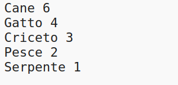
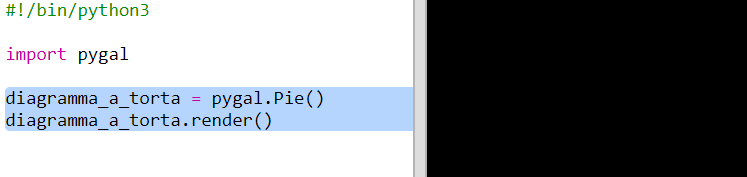
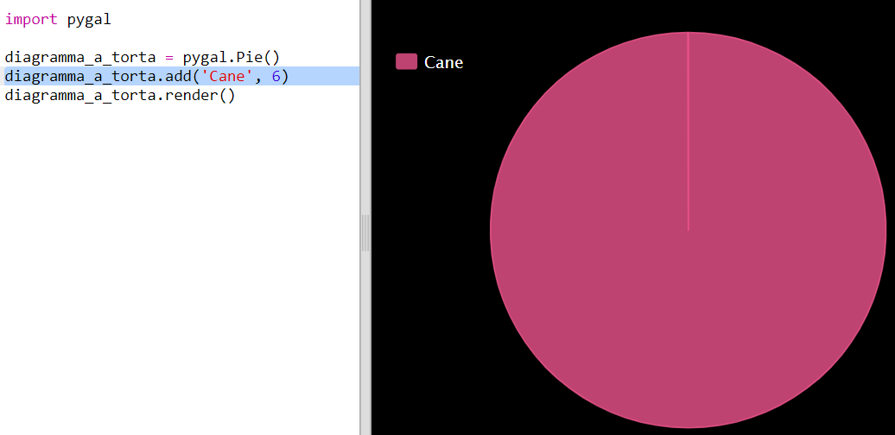
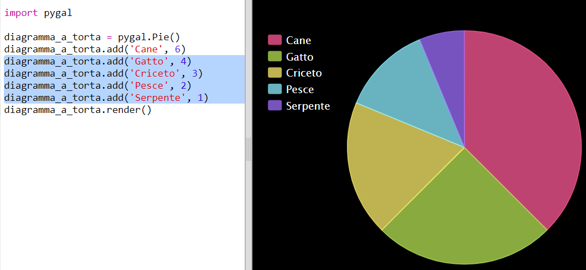
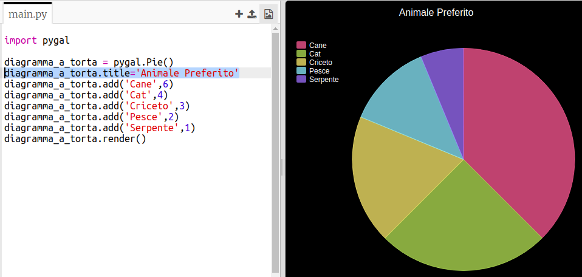

## Crea un grafico a torta

I grafici a torta sono un modo utile per mostrare i dati. Facciamo un sondaggio sugli animali preferiti nel tuo Code Club e presentiamo i dati con un grafico a torta.

+ Se sei in dubbio, chiedi al leader del tuo club. Potresti registrare i risultati su un computer collegato a un proiettore o una lavagna visibile a tutti.
    
    Scrivi un elenco di animali domestici e assicurati di includere il preferito di tutti i partecipanti.
    
    Quindi fai in modo che tutti votino per il loro preferito per alzata di mano, nel momento in cui vengono chiamati. Un solo voto ciascuno!
    
    Per esempio:
    
    

+ Apri un modello vuoto di Python su Trinket: <a href="http://jumpto.cc/python-new" target="_blank">jumpto.cc/python-new</a>.

+ Creiamo un grafico a torta per mostrare i risultati del tuo sondaggio. La libreria PyGal ti aiuterà nella parte più faticosa del lavoro.
    
    Prima importiamo la libreria Pygal:
    
    

+ Ora creiamo un grafico a torta e renderizziamolo (visualizziamolo):
    
    
    
    Non preoccuparti, sarà più interessante una volta che aggiungerai i dati!

+ Aggiungiamo i dati per uno degli animali domestici. Puoi utilizzare i dati che hai raccolto.
    
    
    
    C'è solo un dato che occuperà l'intero grafico a torta.

+ Ora aggiungi il resto dei dati allo stesso modo.
    
    Per esempio:
    
    

+ E per finire il tuo grafico, aggiungi un titolo:
    
    