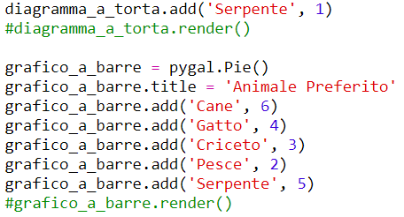
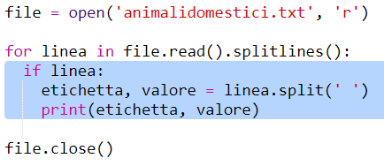

## Leggi i dati di un file

Se possibile, è meglio salvare i dati in un file piuttosto che dovere includerli nel tuo codice.

+ Aggiungi un nuovo file al tuo progetto e chiamalo 'pets.txt':

  

+ Ora aggiungi i dati al file. Puoi usare i dati raccolti sugli animali preferiti o i dati in esempio.

  

+ Torna a 'main.py' e commenta le linee che rappresentano grafici e tabelle (così che non vengono visualizzati):

  

+ Ora leggiamo i dati dal file.

  

  Il loop 'for' girerà sulle linee del file. `splitlines()` elimina il carattere della nuova linea dalla fine della linea.

+ Ogni linea deve essere separata in un'etichetta e un valore:

  

  Questo dividerà la linea agli spazi, per cui non includere gli spazi nelle etichette. (Puoi aggiungere in un secondo momento supporto per gli spazi nelle etichette.)

+ Potresti ottenere un errore così:

  

  Questo succede se hai una linea vuota alla fine del tuo file.

  Puoi risolvere l'errore semplicemente ottenendo l'etichetta e il valore se la linea non è vuota.

  Per fare ciò, fai rientrare il codice dentro il tuo loop 'for' e aggiungi su di esso il codice 'if line:' :

  

+ Puoi rimuovere la linea 'print(label, value), ora funziona tutto.

+ Ora aggiungiamo l'etichetta e il valore al nostro nuovo grafico circolare e rappresentiamoli;

  

  Nota che 'add' prevede che il valore sia un numero, 'int(value) trasforma il valore da una sequenza a un numero intero.

  Se vuoi usare i decimali come 3,5 (numeri a virgola mobile), potresti invece utilizzare 'float(value)'.
