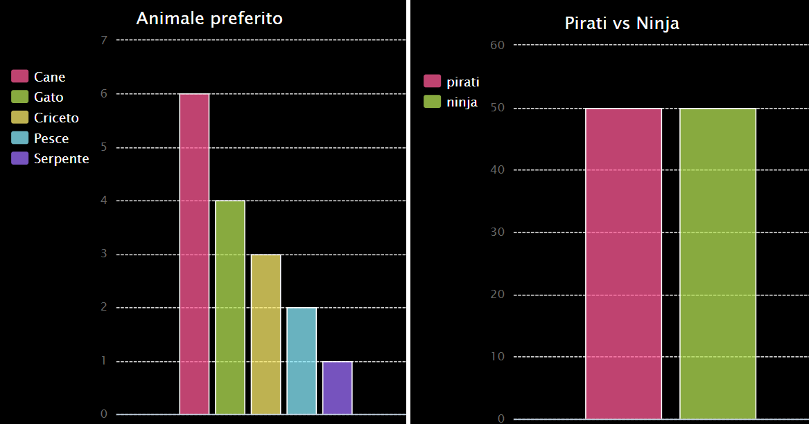

--- challenge ---
## Sfida: Crea il tuo grafico a barre 

Puoi creare grafici a barre in un modo simile. Semplicemente usa `barchart = pygal.Bar()` per creare un nuovo grafico a barre, e poi aggiungi i dati e visualizzali allo stesso modo in cui hai fatto con il grafico circolare.

Raccogli i dati dai soci del tuo Code Club per creare il tuo grafico a barre.

Assicurati di scegliere un argomento che tutti conoscono!

Ecco alcune idee:

+ Qual è il tuo sport preferito?
+ Qual è il gusto di gelato che preferisci?
+ Con quale mezzo vai a scuola?
+ In quale mese compi gli anni?
+ Giochi a Minecraft? (sì/no)

Non fare domande che diano dati personali, come per esempio l'indirizzo delle persone. Se sei in dubbio, chiedi al leader del tuo club.

Esempi:

--- /challenge ---

