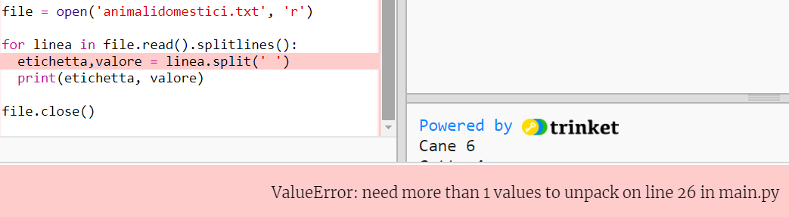

## Carica i dati da un file

È utile poter archiviare i dati in un file piuttosto che doverli includere nel codice.

+ Aggiungi un nuovo file al tuo progetto e salvalo come `animalidomestici.txt`:
    
    

+ Ora aggiungi i dati al file. È possibile utilizzare i dati sugli animali domestici preferiti raccolti o i dati di esempio.
    
    

+ Torna a `main.py` e commenta le righe che renderizzeranno (visualizzano) diagrammi e grafici (in modo che non vengano visualizzati):
    
    

+ Ora leggiamo i dati dal file.
    
    
    
    Il ciclo `for` leggerà le righe del file. `splitlines()` rimuove il carattere di nuova riga dalla fine della riga poiché non serve.

+ Ogni riga deve essere separata in un'etichetta e un valore:
    
    
    
    Questo dividerà la linea in corrispondenza degli spazi, che quindi non saranno inclusi nelle etichette. (È possibile aggiungere il supporto per gli spazi nelle etichette in seguito.)

+ Potresti ottenere un errore di questo tipo:
    
    
    
    Questo accade se hai una riga vuota alla fine del tuo file.
    
    È possibile correggere l'errore ottenendo l'etichetta e il valore solo se la riga non è vuota.
    
    Per fare ciò, rientra il codice all'interno del tuo ciclo `for` e aggiungi il codice `if linea:` sopra di esso:
    
    

+ Puoi rimuovere la riga `print(etichetta, valore)` e ora tutto funzionerà.

+ Adesso aggiungiamo l'etichetta e il valore a un nuovo grafico a torta e renderizziamolo:
    
    
    
    Nota che `add` prevede che il valore sia un numero, `int(valore)` trasforma il valore da una stringa in un numero intero.
    
    Se volessi utilizzare i numeri decimali come ad esempio 3.5 (numeri in virgola mobile) potresti usare `float(valore)`.