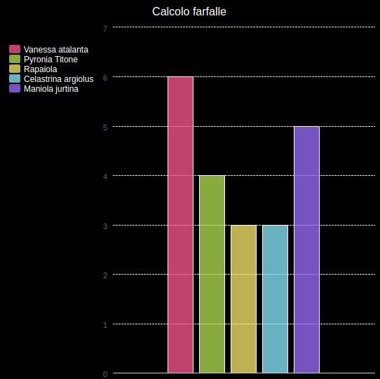

\--- challenge \---

## Sfida: crea un nuovo grafico da un file

Puoi creare un nuovo grafico a barre o grafico a torta dai dati in un file? Dovrai creare un nuovo file .txt.

Suggerimento: se si desidera avere spazi nelle etichette, utilizzare ` line.split (':') ` e aggiungere due punti al tuo file di dati, ad esempio "Vanessa atalanta: 6"

\--- /challenge \---