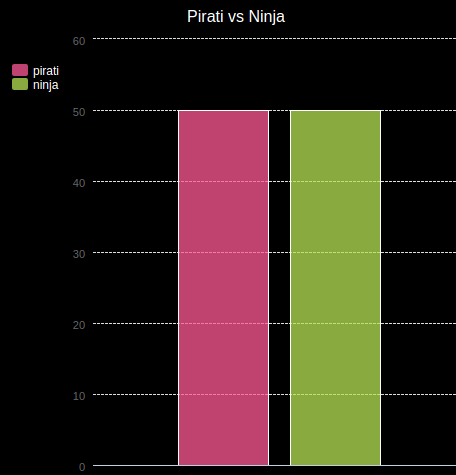
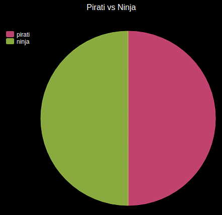

--- challenge ---

## Sfida: più grafici e diagrammi!

Puoi creare un grafico a torta e un grafico a barre dallo stesso file? Puoi utilizzare i dati raccolti in precedenza o raccogliere alcuni nuovi dati.

--- /challenge ---

***
Questo progetto è stato tradotto da volontari:

Omar Lazzari

Katharina Lindenblatt

Grazie ai volontari, possiamo offrire alle persone di tutto il mondo la possibilità di imparare nella loro lingua. Puoi aiutarci a raggiungere più persone offrendoti come volontario per la traduzione - puoi trovare maggiori informazioni su [rpf.io/translate](https://rpf.io/translate).