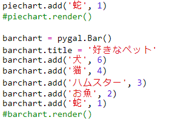
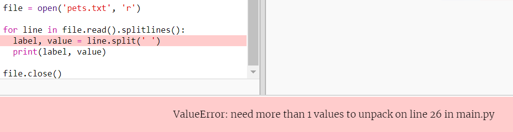
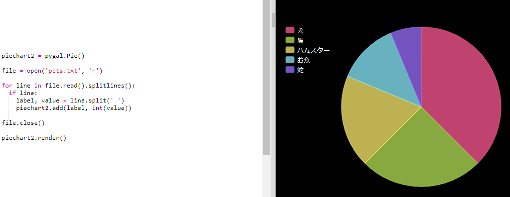

# はじめに {.intro}

このプロジェクトではコードクラブメンバーから集めたデータをもとにして円グラフと棒グラフを作ります。

  <iframe src="https://trinket.io/embed/python/70d24d92b8?outputOnly=true&start=result" width="600" height="500" frameborder="0" marginwidth="0" marginheight="0" allowfullscreen>
  </iframe>
  

# ステップ１:円グラフを作る {.activity}

円グラフはデータを示すのに役立ちます。 コードクラブで大好きなペットについて調査してデータを円グラフにしましょう。

## チェックリスト {.check}

+ コードクラブ指導者のひとに頼んで調査を行いましょう。みんなに見えるように、プロジェクターやホワイトボードに接続されたコンピュータに結果を入力しましょう。
    
    ペットのリストを書き、みんなの大好きなペットが含まれているか確かめましょう。
    
    好きなペットが呼ばれたら、手をあげてもらって全員に投票してもらいましょう。
    
    例えば：
    
    

+ 白紙のPythonテンプレートTrinketを開きます： <a href="http://jumpto.cc/python-new" target="_blank">jumpto.cc/python-new</a>

+ 調査結果を示す円グラフをつくりましょう。PyGalライブラリーを使って大変な作業のいくつかを行います。
    
    最初にPygalライブラリーをインポートします。
    
    

+ 次に円グラフを作って表示しましょう。
    
    
    
    心配いりません。データを加えればもっと面白くなりますよ！

+ ペットの種類の一つにデータを加えてみましょう。受け取ったデータを使います。
    
    
    
    データが一つしかないので、円グラフには一色しかありません。

+ 次に残りのデータを同じように加えます。
    
    例えば：
    
    

+ グラフの名前を付けて完成です。
    
    

## プロジェクトを保存する {.save}

## チャレンジ：棒グラフを作りましょう {.challenge}

同じようにして棒グラフを作れます。`barchart = pygal.Bar()` を使い、円グラフのときと同じようにデータを加えます。

コードクラブのメンバーからデータを集めて棒グラフを作ります。

みんなが知っているトピックを選びましょう！

例えば：

+ 好きなスポーツは？

+ 好きなアイスクリームの味は？

+ 学校への交通手段は？

+ 何月生まれ？

+ あなたはMinecraftをプレーしてますか？（はい・いいえ）

どこに住んでいるかといった個人情報に関する質問はしませんように。わからない場合、クラブリーダーに聞いてみましょう。

例えば：

## プロジェクトを保存する {.save}

# ファイルからデータを読み込む {.activity}

データをコードに含むよりも、ファイルに保存する方が便利です。

## チェックリスト {.check}

+ 新規ファイルを追加し、名前を`pets.txt`とします。
    
    

+ 大好きなペットのデータやデータ例を使います。
    
    

+ `main.py`に切り替えて、グラフ表示に関するプログラムのソースファイルをコメントに変更して、実行されないようにします（グラフが表示されないように）。
    
    

+ ファイルからデータを読み込みましょう。
    
    
    
    `for`の繰り返しはファイル内の行に繰り返し適用されます。`splitlines()`は新しい行に改行して表示します。 

+ 各行はラベルとバリューに分けられます。
    
    
    
    スペースがあるところで改行しますからラベルにはスペースを入れないでください。（ラベルにスペースが必要な場合、後で追加できます。）

+ つぎのようなエラーが出るかもしれません。
    
    
    
    これは、ファイルの最後の行に何も入力されていない場合に出てきます。
    
    最後の行に入れるデータがある場合、ラベルとバリューを追加入力すればエラーは解決します。
    
    そのために、`for`の繰り返しのコードの中でインデントしてその上に`if line:`を追加します。
    
    

+ `print(label, value)`は削除します。

+ 円グラフにラベルとバリューを追加して表示してみましょう。
    
    
    
    `add`ではバリューは数値であることは必要です。`int(value)`はバリューを文字列から数値に変換します。
    
    3.5などの少数を使いたい場合、`float(value)`を使います。

## プロジェクトを保存する {.save}

## チャレンジ：ファイルから新規グラフをつくろう {.challenge}

ファイルの中のデータを使って新規棒グラフか円グラフを作れますか？新規の.txtファイルを作りましょう。

ヒント：ラベル内」にスペースが必要なら、`line.split(': ')`を使い、Red Admiral: 6というように、コロンをデータファイル内に追加します。

## プロジェクトを保存する {.save}

## チャレンジ：さらにグラフをつくろう！ {.challenge}

円グラフと棒グラフを同じファイルから作成できましたか？以前からあるデータを使っても、新しいデータを集めてもよいです。

## プロジェクトを保存する {.save}