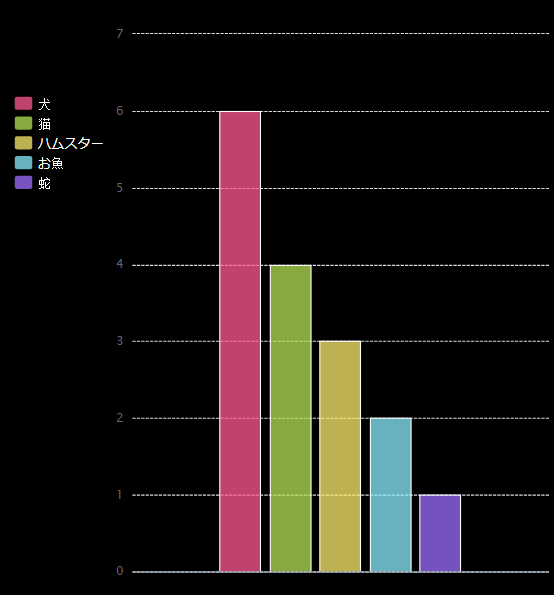

## はじめに

このプロジェクトではコードクラブメンバーから集めたデータをもとにして円グラフと棒グラフを作ります。

### 説明

RUNをクリックすると、PyGal Python モジュールを使って、データからグラフが作られます。

  <iframe src="https://trinket.io/embed/python/70d24d92b8?outputOnly=true&start=result" width="600" height="500" frameborder="0" marginwidth="0" marginheight="0" allowfullscreen>
  </iframe>
  

### 学習内容

このプロジェクトは[Raspberry Piのデジタル作成カリキュラム](http://rpf.io/curriculum)における以下の部分を含みます。

+ [問題解決のためにプログラミング要素を組み合わせる](https://www.raspberrypi.org/curriculum/programming/builder/)

### 教育者への追加情報

このプロジェクトを印刷する必要がある場合は、 [印刷用バージョン](https://projects.raspberrypi.org/en/projects/about-me/print){：target = "_ blank"}を使用してください。

フッターのあるリンクから、本プロジェクトのGitHubリポジトリ内の（過去の完成したプロジェクトの例を含む）全ての資料を含む'en/resources'フォルダにアクセスできます。