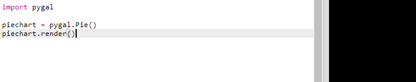
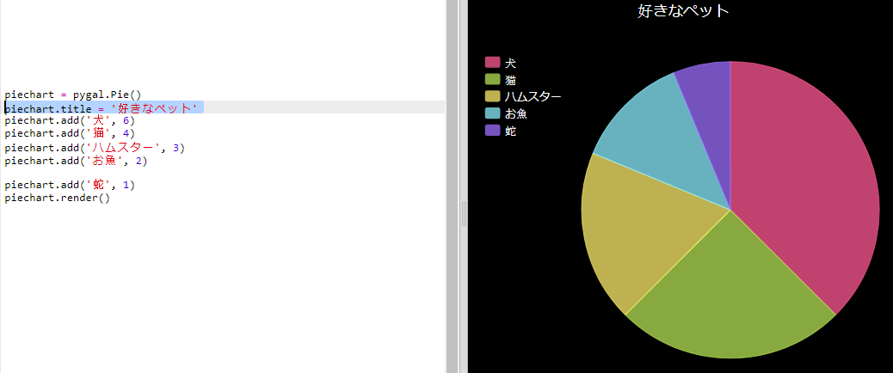

## 円グラフを作る

Pie Charts are useful way of showing data. Let's do a survey of favourite pets in your Code Club and then present the data as a Pie Chart.

+ Ask your club leader to help organise a survey. みんなに見えるように、プロジェクターやホワイトボードに接続されたコンピュータに結果を入力しましょう。
    
    ペットのリストを書き、みんなの大好きなペットが含まれているか確かめましょう。
    
    好きなペットが呼ばれたら、手をあげてもらって全員に投票してもらいましょう。 一人一票です！
    
    For example:
    
    

+ Open the blank Python template Trinket: <a href="http://jumpto.cc/python-new" target="_blank">jumpto.cc/python-new</a>.

+ 調査結果を示す円グラフをつくりましょう。 You'll be using the PyGal library to do some of the hard work.
    
    最初にPygalライブラリーをインポートします。
    
    

+ Now let's create a Pie chart and render (display) it:
    
    
    
    Don't worry, it gets more interesting when you add data!

+ Let's add in the data for one of the pets. Use the data that you collected.
    
    
    
    There's only one piece of data so it takes up the whole pie chart.

+ 次に残りのデータを同じように加えます。
    
    例えば:
    
    

+ And to finish off your chart, add a title:
    
    