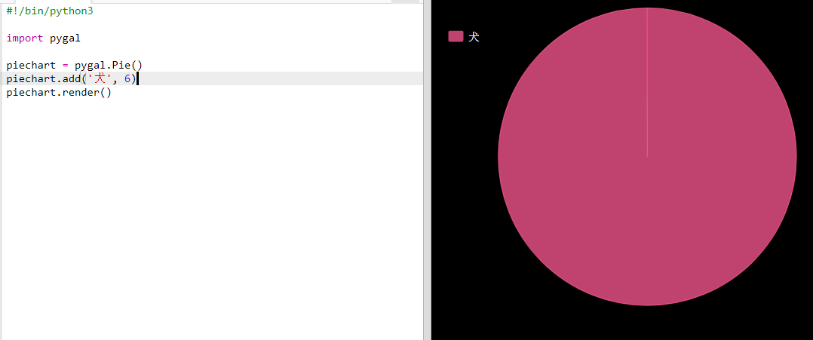

## 円グラフを作る

円グラフはデータを表示する便利な方法です。 Code Clubで大好きなペットについて調査してデータを円グラフとして表示しましょう。

+ クラブのリーダーに頼み調査を計画しましょう。 みんなに見えるように、プロジェクターやホワイトボードに接続されたコンピュータに結果を入力しましょう。
    
    ペットのリストを書き、みんなの大好きなペットが含まれているか確かめましょう。
    
    好きなペットが呼ばれたら、手をあげてもらって全員に投票してもらいましょう。 一人一票です！
    
    例えば:
    
    

+ 空のPythonテンプレートTrinketを開きます: <a href="http://jumpto.cc/python-new" target="_blank">jumpto.cc/python-new</a>

+ 調査結果を示す円グラフをつくりましょう。 PyGalライブラリーを使っていくつかの大変な作業を行います。
    
    最初にPygalライブラリーをインポートします。
    
    

+ 次に円グラフを作ってレンダリング(表示) しましょう:
    
    
    
    心配いりません。データを加えればもっと面白くなります！

+ ペットの１つをデータを加えてみましょう。 集めたデータを使います。
    
    
    
    データが１つしかないので、円グラフ全体となります。

+ 次に残りのデータを同じように加えます。
    
    例えば:
    
    

+ グラフを完成させるために、title: を追加します。
    
    