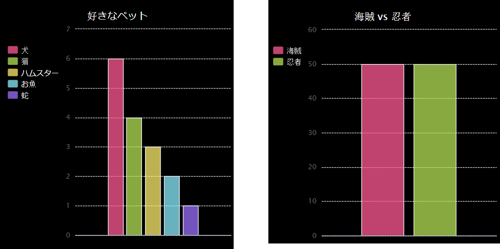

\--- challenge \---

## チャレンジ：棒グラフを作りましょう

同じようにして棒グラフを作れます。 `barchart = pygal.Bar()` を使い、円グラフのときと同じようにデータを加えます。

コードクラブのメンバーからデータを集めて棒グラフを作ります。

みんなが知っているトピックを選びましょう！

例えば：

+ 好きなスポーツは？
+ 好きなアイスクリームの味は？
+ 学校への交通手段は？
+ 何月生まれ？
+ あなたはMinecraftをプレーしてますか？ （はい・いいえ）

どこに住んでいるかといった個人情報に関する質問はしませんように。 わからない場合、クラブリーダーに聞いてみましょう。

例えば：

\--- /challenge \---