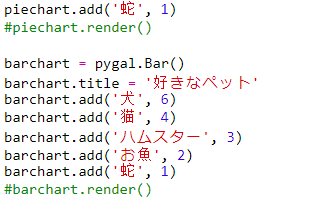
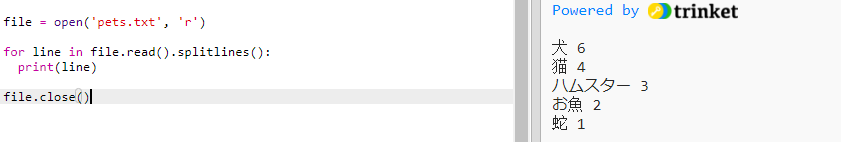
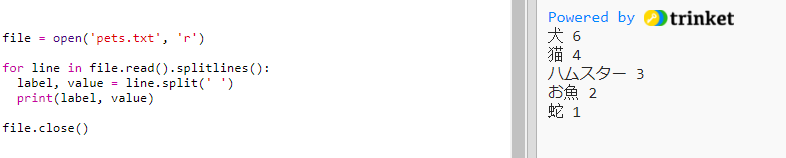
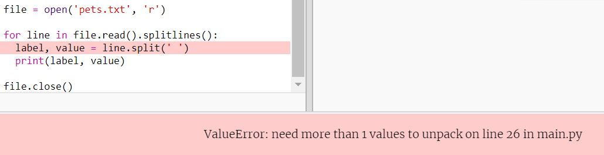
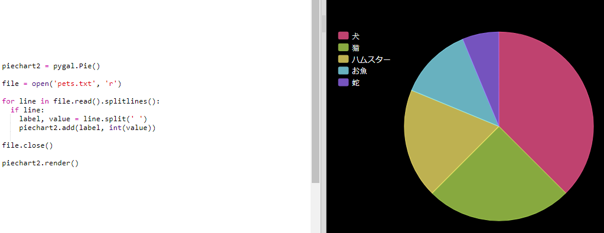

## ファイルからデータを読み込む

データをコードに含むよりも、ファイルに保存できる方が便利です。

+ 新規ファイルを追加し、名前を`pets.txt`とします。
    
    

+ 次に、ファイルにデータを追加します。 集めたお気に入りのペットデータまたはサンプルデータを使用できます。
    
    

+ `main.py`に戻り、グラフのレンダリング(表示) する行をコメントアウトします(表示されないように):
    
    

+ 次に、ファイルからデータを読み込みましょう。
    
    
    
    `for`ループはファイル内の行を繰り返します。 `splitlines()`は、行末から改行文字を削除します。

+ 各行はラベルと値に分けられる必要があります:
    
    
    
    スペースがあるところで分割されるので、ラベルにはスペースを入れないでください。 (ラベル中のスペースに必要なサポートは後で追加できます。)

+ つぎのようなエラーが出るかもしれません。
    
    
    
    これは、ファイルの最後に空の行がある場合に出てきます。
    
    行が空でないのであれば、ラベルと値を取得することのみでエラーは修正できます。
    
    そのために、`for`ループ内のコードをインデントし、その上に`if line:`コードを追加します。
    
    

+ `print(label, value)` 行を削除して、すべてが機能するようになりました。

+ 次に、新しい円グラフにラベルと値を追加してレンダリングします:
    
    
    
    `add`は値が数値であることを想定し、`int(value)`は文字列から数値に変換した値を返すことに注意してください。
    
    3.5(浮動小数点) などの少数を使いたい場合、代わりに`float(value)`を使えます。