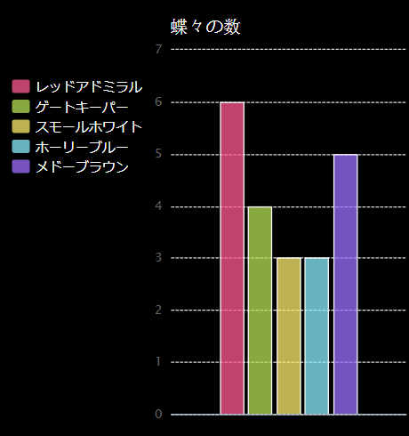

\--- challenge \---

## チャレンジ：ファイルから新規グラフをつくろう

ファイルの中のデータを使って新規棒グラフか円グラフを作れますか？ 新規の.txtファイルを作りましょう。

ヒント：ラベル内」にスペースが必要なら、`line.split(': ')`を使い、レッドアドミラル: 6というように、コロンをデータファイル内に追加します。

\--- /challenge \---