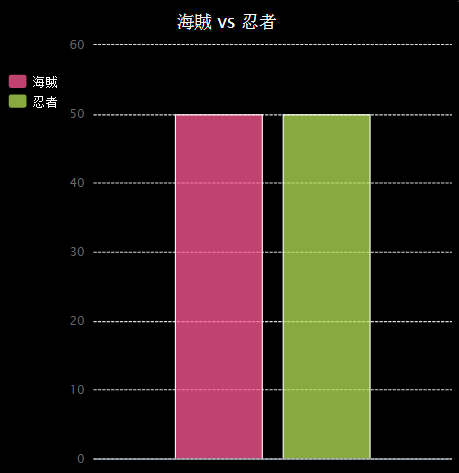

--- challenge ---

## チャレンジ: さらにグラフをつくろう！

円グラフと棒グラフを同じファイルから作成できましたか？ 前に集めたデータを使っても、新しいデータを集めてもよいです。

--- /challenge ---

***
このプロジェクトは以下のボランティアによって翻訳されました。

Shu Hayakawa 

斉藤友明

ボランティアのおかげで、世界中の人々に母国語で学ぶ機会を与えることができます。翻訳を引き受けていただくことで、より多くの人々に手を差し伸べることができます。詳しくは [rpf.io/translate](https://rpf.io/translate) をご覧ください。