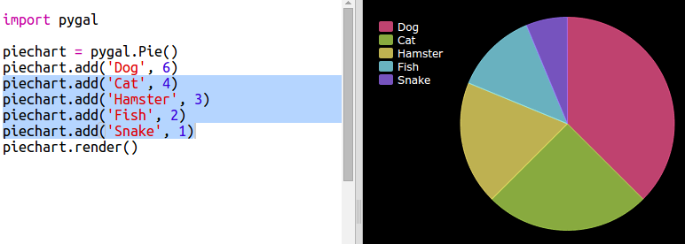

# ಪರಿಚಯ {.intro}

ಈ ಯೋಜನೆಯಲ್ಲಿ ನಿಮ್ಮ Code Club ಸದಸ್ಯರಿಂದ ನೀವು ಸಂಗ್ರಹಿಸುವ ಡೇಟಾದಿಂದ ಪೈ ಚಾರ್ಟ್ (pie chart) ಮತ್ತು ಬಾರ್ ಗ್ರಾಫ್ (bar graph)‌ಗಳನ್ನು ನೀವು ರಚಿಸುತ್ತೀರಿ.

  <iframe src="https://trinket.io/embed/python/70d24d92b8?outputOnly=true&start=result" width="600" height="500" frameborder="0" marginwidth="0" marginheight="0" allowfullscreen>
  </iframe>
  

# ಹಂತ 1: ಪೈ ಚಾರ್ಟ್ ರಚಿಸಿ {.activity}

ಪೈ ಚಾರ್ಟ್‌ಗಳು ಡೇಟಾವನ್ನು ತೋರಿಸುವ ಉಪಯುಕ್ತ ಮಾರ್ಗಗಳಾಗಿವೆ. ನಿಮ್ಮ Code Club ‌ನಲ್ಲಿ ನೆಚ್ಚಿನ ಸಾಕುಪ್ರಾಣಿಗಳ ಸಮೀಕ್ಷೆಯನ್ನು ಮಾಡೋಣ ಮತ್ತು ನಂತರ ಡೇಟಾವನ್ನು ಪೈ ಚಾರ್ಟ್ ಆಗಿ ಪ್ರಸ್ತುತಪಡಿಸೋಣ.

## ಚಟುವಟಿಕೆ ಪರಿಶೀಲನಾಪಟ್ಟಿ {.check}

+ ಸಮೀಕ್ಷೆಯನ್ನು ಆಯೋಜಿಸಲು ಸಹಾಯ ಮಾಡಲು ನಿಮ್ಮ ಸ್ವಯಂಸೇವಕರನ್ನು ಕೇಳಿ. ಎಲ್ಲರಿಗೂ ಕಾಣುವ ಪ್ರೊಜೆಕ್ಟರ್(projector) ಅಥವಾ ವೈಟ್‌ಬೋರ್ಡ್‌ಗೆ(whiteboard) ಸಂಪರ್ಕಗೊಂಡಿರುವ ಕಂಪ್ಯೂಟರ್‌ನಲ್ಲಿ ನೀವು ಫಲಿತಾಂಶಗಳನ್ನು ರೆಕಾರ್ಡ್ ಮಾಡಬಹುದು.
    
    ಸಾಕುಪ್ರಾಣಿಗಳ ಪಟ್ಟಿಯನ್ನು ಬರೆಯಿರಿ ಮತ್ತು ಎಲ್ಲರ ಮೆಚ್ಚಿನವುಗಳನ್ನು ಸೇರಿಸಲಾಗಿದೆಯೆ ಎಂದು ಖಚಿತಪಡಿಸಿಕೊಳ್ಳಿ.
    
    ನಂತರ ತಮ್ಮನ್ನು ಕರೆದ ನಂತರ ಕೈ ಮೇಲೆತ್ತುವ ಮೂಲಕ ಪ್ರತಿಯೊಬ್ಬರೂ ತಮ್ಮ ನೆಚ್ಚಿನವರಿಗೆ ಮತ ಚಲಾಯಿಸಲು ಕರೆತನ್ನಿ. ತಲಾ ಒಂದು ಮತ ಮಾತ್ರ!
    
    ಉದಾಹರಣೆಗೆ:
    
    

+ ಖಾಲಿ Python template Trinket ಅನ್ನು ತೆರೆಯಿರಿ: <a href="http://jumpto.cc/python-new" target="_blank">jumpto.cc/python-new </a>.

+ ನಿಮ್ಮ ಸಮೀಕ್ಷೆಯ ಫಲಿತಾಂಶಗಳನ್ನು ತೋರಿಸಲು ಪೈ ಚಾರ್ಟ್ ರಚಿಸೋಣ. ಕೆಲವು ಕಠಿಣ ಕೆಲಸಗಳನ್ನು ಮಾಡಲು ನೀವು PyGal library ಬಳಸುತ್ತೀರಿ.
    
    ಮೊದಲು PyGal library ಆಮದು(import) ಮಾಡಿ:
    
    

+ ಈಗ ಪೈ ಚಾರ್ಟ್ ಅನ್ನು ರಚಿಸೋಣ ಮತ್ತು ಅದನ್ನು ನಿರೂಪಿಸಿ (display) ಮಾಡೋಣ:
    
    
    
    ಚಿಂತಿಸಬೇಡಿ, ನೀವು ಡೇಟಾವನ್ನು ಸೇರಿಸಿದಾಗ ಅದು ಹೆಚ್ಚು ಆಸಕ್ತಿಕರವಾಗಿರುತ್ತದೆ!

+ ಸಾಕುಪ್ರಾಣಿಗಳಲ್ಲಿ ಒಂದಕ್ಕೆ ಡೇಟಾವನ್ನು ಸೇರಿಸೋಣ. ನೀವು ಸಂಗ್ರಹಿಸಿದ ಡೇಟಾವನ್ನು ಬಳಸಿ.
    
    
    
    ಕೇವಲ ಒಂದು ತುಣುಕು ಡೇಟಾ ಇದೆ ಆದ್ದರಿಂದ ಅದು ಇಡೀ ಪೈ ಚಾರ್ಟ್ ಅನ್ನು ತೆಗೆದುಕೊಳ್ಳುತ್ತದೆ.

+ ಈಗ ಉಳಿದ ಡೇಟಾವನ್ನು ಅದೇ ರೀತಿಯಲ್ಲಿ ಸೇರಿಸಿ.
    
    ಉದಾಹರಣೆಗೆ:
    
    

+ ಮತ್ತು ನಿಮ್ಮ ಚಾರ್ಟ್ ಅನ್ನು ಮುಗಿಸಲು, title ಅನ್ನು ಸೇರಿಸಿ:
    
    

## ನಿಮ್ಮ ಯೋಜನೆಯನ್ನು ಸೇವ್ (save) ಮಾಡಿ {.save}

## ಸವಾಲು: ನಿಮ್ಮ ಸ್ವಂತ ಬಾರ್ ಚಾರ್ಟ್(bar chart) ರಚಿಸಿ {.challenge}

ನೀವು ಬಾರ್ ಚಾರ್ಟ್ ಗಳನ್ನು ಇದೆ ರೀತಿಯಾಗಿ ರಚಿಸಬಹುದು. ಹೊಸ ಬಾರ್ ಚಾರ್ಟ್ ರಚಿಸಲು `barchart = pygal.Bar()` ಅನ್ನು ಬಳಸಿರಿ, ತದನಂತರ ಡೇಟಾ ಸೇರಿಸಿ ಮತ್ತು ಪೈ ಚಾರ್ಟ್ ನಂತೆಯೇ ನಿರೂಪಿಸಿ.

ನಿಮ್ಮ ಸ್ವಂತ ಬಾರ್ ಗ್ರಾಫ್ ರಚಿಸಲು ನಿಮ್ಮ Code Club ಸದಸ್ಯರಿಂದ ಡೇಟಾವನ್ನು ಸಂಗ್ರಹಿಸಿ.

ಪ್ರತಿಯೊಬ್ಬರೂ ತಿಳಿದುಕೊಳ್ಳುವ ವಿಷಯವನ್ನು ನೀವು ಆರಿಸಿದ್ದೀರಿ ಎಂದು ಖಚಿತಪಡಿಸಿಕೊಳ್ಳಿ!

ಕೆಲವು ವಿಚಾರಗಳು ಇಲ್ಲಿವೆ:

+ ನಿಮ್ಮ ನೆಚ್ಚಿನ ಕ್ರೀಡೆ ಯಾವುದು?

+ ನಿಮ್ಮ ನೆಚ್ಚಿನ ಐಸ್ ಕ್ರೀಮ್ ರುಚಿ ಯಾವುದು?

+ ನೀವು ಶಾಲೆಗೆ ಹೇಗೆ ಹೋಗುತ್ತೀರಿ?

+ ನಿಮ್ಮ ಜನ್ಮದಿನ ಯಾವ ತಿಂಗಳು?

+ ನೀವು Minecraft ಆಡುತ್ತೀರಾ? (ಹೌದು/ಅಲ್ಲ)

ಜನರು ಎಲ್ಲಿ ವಾಸಿಸುತ್ತಾರೆ ಎಂಬಂತಹ ವೈಯಕ್ತಿಕ ಡೇಟಾವನ್ನು ನೀಡುವ ಪ್ರಶ್ನೆಗಳನ್ನು ಕೇಳಬೇಡಿ. ನಿಮಗೆ ಖಚಿತವಿಲ್ಲದಿದ್ದರೆ ನಿಮ್ಮ ಕ್ಲಬ್(club) ನಾಯಕನನ್ನು ಕೇಳಿ.

ಉದಾಹರಣೆಗಳು:

## ನಿಮ್ಮ ಯೋಜನೆಯನ್ನು ಸೇವ್ (save) ಮಾಡಿ {.save}

# ಹಂತ 2: ಫೈಲ್‌ನಿಂದ ಡೇಟಾವನ್ನು ಓದಿ {.activity}

ನಿಮ್ಮ ಕೋಡ್‌ನಲ್ಲಿ ಡೇಟಾವನ್ನು ಸೇರಿಸುವ ಬದಲು ಫೈಲ್‌ನಲ್ಲಿ ಡೇಟಾವನ್ನು ಸಂಗ್ರಹಿಸಲು ಇದು ಉಪಯುಕ್ತವಾಗಿದೆ.

## ಚಟುವಟಿಕೆ ಪರಿಶೀಲನಾಪಟ್ಟಿ {.check}

+ ನಿಮ್ಮ ಯೋಜನೆಗೆ ಹೊಸ ಫೈಲ್ ಅನ್ನು ಸೇರಿಸಿ ಮತ್ತು ಅದನ್ನು `pets.txt` ಎಂದು ಕರೆಯಿರಿ:
    
    

+ ಈಗ ಫೈಲ್‌ಗೆ ಡೇಟಾವನ್ನು ಸೇರಿಸಿ. ನೀವು ಸಂಗ್ರಹಿಸಿದ ನೆಚ್ಚಿನ ಸಾಕುಪ್ರಾಣಿಗಳ ಡೇಟಾ ಅಥವಾ ಉದಾಹರಣೆಯ ಡೇಟಾವನ್ನು ನೀವು ಬಳಸಬಹುದು.
    
    

+ `main.py` ಗೆ ಹಿಂತಿರುಗಿ ಮತ್ತು ಚಾರ್ಟ್ ಮತ್ತು ಗ್ರಾಫ್‌ಗಳನ್ನು ನಿರೂಪಿಸುವ (display) ಸಾಲುಗಳನ್ನು ಕಾಮೆಂಟ್ ಮಾಡಿ (ಆದ್ದರಿಂದ ಅವುಗಳನ್ನು ಪ್ರದರ್ಶಿಸಲಾಗುವುದಿಲ್ಲ):
    
    

+ ಈಗ data file ಇಂದ ಓದಿ.
    
    
    
    `for` loop file ‌ನಲ್ಲಿನ ರೇಖೆಗಳ ಮೇಲೆ loop ಆಗುತ್ತದೆ. `splitlines()` ನಿಮಗೆ ಇಷ್ಟವಿಲ್ಲದ ಕಾರಣ ಹೊಸ ಸಾಲಿನ ಅಕ್ಷರವನ್ನು ಸಾಲಿನ ಕೊನೆಯಲ್ಲಿ ತೆಗೆದುಹಾಕುತ್ತದೆ.

+ ಪ್ರತಿಯೊಂದು ಸಾಲನ್ನು label ಮತ್ತು value ಆಗಿ ಬೇರ್ಪಡಿಸುವ ಅಗತ್ಯವಿದೆ:
    
    
    
    ಇದು ಸ್ಥಳಗಳಲ್ಲಿ ರೇಖೆಯನ್ನು ವಿಭಜಿಸುತ್ತದೆ ಆದ್ದರಿಂದ label ‌ಗಳಲ್ಲಿ ಖಾಲಿ ಜಾಗವನ್ನು ಸೇರಿಸಬೇಡಿ. (label ‌ಗಳಲ್ಲಿನ ಖಾಲಿ ಜಾಗಗಳಿಗೆ ನೀವು ನಂತರ ಬೆಂಬಲವನ್ನು ಸೇರಿಸಬಹುದು.)

+ ನೀವು ಈ ರೀತಿಯ ದೋಷವನ್ನು ಪಡೆಯಬಹುದು:
    
    
    
    ನಿಮ್ಮ file ನ ಕೊನೆಯಲ್ಲಿ ನೀವು ಖಾಲಿ ರೇಖೆಯನ್ನು ಹೊಂದಿದ್ದರೆ ಇದು ಸಂಭವಿಸುತ್ತದೆ.
    
    ಸಾಲು ಖಾಲಿಯಾಗಿಲ್ಲದಿದ್ದರೆ ಮಾತ್ರ label ಮತ್ತು file ಅನ್ನು ಪಡೆಯುವ ಮೂಲಕ ನೀವು ದೋಷವನ್ನು ಸರಿಪಡಿಸಬಹುದು.
    
    ಇದನ್ನು ಮಾಡಲು, ನಿಮ್ಮ `for` loop ನಲ್ಲಿ ಕೋಡ್ ಅನ್ನು ಇಂಡೆಂಟ್(indent) ಮಾಡಿ ಮತ್ತು ಇದರ ಮೇಲೆ `if line:` code ಅನ್ನು ಸೇರಿಸಿ:
    
    

+ ನೀವು `print(label, value)` ಸಾಲನ್ನು ತೆಗೆದುಹಾಕಬಹುದು ಈಗ ಎಲ್ಲವೂ ಕಾರ್ಯನಿರ್ವಹಿಸುತ್ತಿದೆ.

+ ಈಗ ಹೊಸ ಪೈ ಚಾರ್ಟ್ಗೆ label ಮತ್ತು value ಅನ್ನು ಸೇರಿಸೋಣ ಮತ್ತು ಅದನ್ನು ನಿರೂಪಿಸೋಣ:
    
    
    
    `add` ಮೌಲ್ಯವು ಒಂದು ಸಂಖ್ಯೆಯೆಂದು ನಿರೀಕ್ಷಿಸುತ್ತದೆ ಎಂಬುದನ್ನು ಗಮನಿಸಿ, `int(value)` ಸ್ಟ್ರಿಂಗ್(string) ‌ನಿಂದ ಮೌಲ್ಯವನ್ನು ಪೂರ್ಣಾಂಕ(integer) ವಾಗಿ ಪರಿವರ್ತಿಸುತ್ತದೆ.
    
    ನೀವು 3.5 (floating point numbers) ನಂತಹ ದಶಮಾಂಶ(decimal) ಗಳನ್ನು ಬಳಸಲು ಬಯಸಿದರೆ ನೀವು ಬದಲಿಗೆ `float(value)` ಅನ್ನು ಬಳಸಬಹುದು.

## ನಿಮ್ಮ ಯೋಜನೆಯನ್ನು ಸೇವ್ (save) ಮಾಡಿ {.save}

## ಸವಾಲು: file ‌ನಿಂದ ಹೊಸ ಚಾರ್ಟ್ ರಚಿಸಿ {.challenge}

file ‌ನಲ್ಲಿನ ಡೇಟಾದಿಂದ ನೀವು ಹೊಸ ಬಾರ್ ಗ್ರಾಫ್ ಅಥವಾ ಪೈ ಚಾರ್ಟ್ ಅನ್ನು ರಚಿಸಬಹುದೇ? ನೀವು ಹೊಸ .txt file ಅನ್ನು ರಚಿಸಬೇಕಾಗಿದೆ.

ಸುಳಿವು: ನೀವು label ಗಳಲ್ಲಿ ಖಾಲಿ ಜಾಗವನ್ನು ಹೊಂದಲು ಬಯಸಿದರೆ `line.split (':')` ಬಳಸಿ ಮತ್ತು ನಿಮ್ಮ ಡೇಟಾ ಫೈಲ್‌ಗೆ colon ‌ಗಳನ್ನು ಸೇರಿಸಿ, ಉದಾ. 'Red Admiral: 6'

## ನಿಮ್ಮ ಯೋಜನೆಯನ್ನು ಸೇವ್ (save) ಮಾಡಿ {.save}

## ಸವಾಲು: ಹೆಚ್ಚಿನ ಚಾರ್ಟ್(chart) ‌ಗಳು ಮತ್ತು ಗ್ರಾಫ್(graph)‌ಗಳು! {.challenge}

ಒಂದೇ file ‌ನಿಂದ ಪೈ ಚಾರ್ಟ್ ಮತ್ತು ಬಾರ್ ಚಾರ್ಟ್ ಅನ್ನು ನೀವು ರಚಿಸಬಹುದೇ? ನೀವು ಮೊದಲು ಸಂಗ್ರಹಿಸಿದ ಡೇಟಾವನ್ನು ಬಳಸಬಹುದು ಅಥವಾ ಕೆಲವು ಹೊಸ ಡೇಟಾವನ್ನು ಸಂಗ್ರಹಿಸಬಹುದು.

## ನಿಮ್ಮ ಯೋಜನೆಯನ್ನು ಸೇವ್ (save) ಮಾಡಿ {.save}