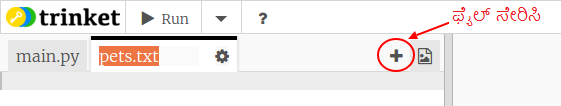
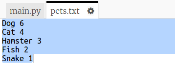
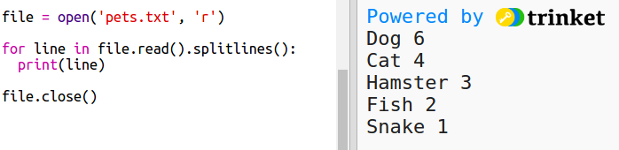

## file ‌ನಿಂದ ಡೇಟಾವನ್ನು ಓದಿ

ನಿಮ್ಮ ಕೋಡ್‌ನಲ್ಲಿ ಡೇಟಾವನ್ನು ಸೇರಿಸುವ ಬದಲು ಫೈಲ್‌ನಲ್ಲಿ ಡೇಟಾವನ್ನು ಸಂಗ್ರಹಿಸಲು ಇದು ಉಪಯುಕ್ತವಾಗಿದೆ.

+ ನಿಮ್ಮ ಯೋಜನೆಗೆ ಹೊಸ ಫೈಲ್ ಅನ್ನು ಸೇರಿಸಿ ಮತ್ತು ಅದನ್ನು `pets.txt` ಎಂದು ಕರೆಯಿರಿ:
    
    

+ ಈಗ ಫೈಲ್‌ಗೆ ಡೇಟಾವನ್ನು ಸೇರಿಸಿ. ನೀವು ಸಂಗ್ರಹಿಸಿದ ನೆಚ್ಚಿನ ಸಾಕುಪ್ರಾಣಿಗಳ ಡೇಟಾ ಅಥವಾ ಉದಾಹರಣೆಯ ಡೇಟಾವನ್ನು ನೀವು ಬಳಸಬಹುದು.
    
    

+ `main.py` ಗೆ ಹಿಂತಿರುಗಿ ಮತ್ತು ಚಾರ್ಟ್ ಮತ್ತು ಗ್ರಾಫ್‌ಗಳನ್ನು ನಿರೂಪಿಸುವ (display) ಸಾಲುಗಳನ್ನು ಕಾಮೆಂಟ್ ಮಾಡಿ (ಆದ್ದರಿಂದ ಅವುಗಳನ್ನು ಪ್ರದರ್ಶಿಸಲಾಗುವುದಿಲ್ಲ):
    
    

+ ಈಗ data file ಇಂದ ಓದಿ.
    
    
    
    `for` loop ಫೈಲ್‌ನಲ್ಲಿನ ರೇಖೆಗಳ ಮೇಲೆ loop ಆಗುತ್ತದೆ. ನಿಮಗೆ ಇಷ್ಟವಿಲ್ಲದ ಕಾರಣ ಸಾಲಿನ ಕೊನೆಯಲ್ಲಿ ಹೊಸ ಲೈನ್ ಅಕ್ಷರವನ್ನು `splitlines()` ತೆಗೆದುಹಾಕುತ್ತದೆ.

+ ಪ್ರತಿಯೊಂದು ಸಾಲನ್ನು ಲೇಬಲ್(lable) ಮತ್ತು ಮೌಲ್ಯ(value) ವಾಗಿ ಬೇರ್ಪಡಿಸುವ ಅಗತ್ಯವಿದೆ:
    
    
    
    ಇದು ಖಾಲಿ ಜಾಗಗಳಲ್ಲಿ ರೇಖೆಯನ್ನು ವಿಭಜಿಸುತ್ತದೆ ಆದ್ದರಿಂದ ಲೇಬಲ್‌ಗಳಲ್ಲಿ ಖಾಲಿ ಜಾಗಗಳನ್ನು ಸೇರಿಸಬೇಡಿ. (ಲೇಬಲ್‌ಗಳಲ್ಲಿನ ಖಾಲಿ ಜಾಗಗಳಿಗೆ ನೀವು ನಂತರ ಬೆಂಬಲವನ್ನು ಸೇರಿಸಬಹುದು.)

+ ನೀವು ಈ ರೀತಿಯ ದೋಷವನ್ನು ಪಡೆಯಬಹುದು:
    
    
    
    ನಿಮ್ಮ file ನ ಕೊನೆಯಲ್ಲಿ ನೀವು ಖಾಲಿ ರೇಖೆಯನ್ನು ಹೊಂದಿದ್ದರೆ ಇದು ಸಂಭವಿಸುತ್ತದೆ.
    
    ಸಾಲು ಖಾಲಿಯಾಗಿಲ್ಲದಿದ್ದರೆ ಮಾತ್ರ label ಮತ್ತು value ಅನ್ನು ಪಡೆಯುವ ಮೂಲಕ ನೀವು ದೋಷವನ್ನು ಸರಿಪಡಿಸಬಹುದು.
    
    ಇದನ್ನು ಮಾಡಲು, ನಿಮ್ಮ `for` loop ನಲ್ಲಿ ಕೋಡ್ ಅನ್ನು ಇಂಡೆಂಟ್(indent) ಮಾಡಿ ಮತ್ತು ಇದರ ಮೇಲೆ `if line:` code ಅನ್ನು ಸೇರಿಸಿ:
    
    

+ ನೀವು `print(label, value)` ಸಾಲನ್ನು ತೆಗೆದುಹಾಕಬಹುದು ಈಗ ಎಲ್ಲವೂ ಕಾರ್ಯನಿರ್ವಹಿಸುತ್ತಿದೆ.

+ ಈಗ ಹೊಸ ಪೈ ಚಾರ್ಟ್ಗೆ label ಮತ್ತು value ಅನ್ನು ಸೇರಿಸೋಣ ಮತ್ತು ಅದನ್ನು ನಿರೂಪಿಸೋಣ:
    
    
    
    `add` ಮೌಲ್ಯವು ಒಂದು ಸಂಖ್ಯೆಯೆಂದು ನಿರೀಕ್ಷಿಸುತ್ತದೆ ಎಂಬುದನ್ನು ಗಮನಿಸಿ, `int(value)` ಸ್ಟ್ರಿಂಗ್(string) ‌ನಿಂದ ಮೌಲ್ಯವನ್ನು ಪೂರ್ಣಾಂಕ(integer) ವಾಗಿ ಪರಿವರ್ತಿಸುತ್ತದೆ.
    
    ನೀವು 3.5 (floating point numbers) ನಂತಹ ದಶಮಾಂಶ(decimal) ಗಳನ್ನು ಬಳಸಲು ಬಯಸಿದರೆ ನೀವು ಬದಲಿಗೆ `float(value)` ಅನ್ನು ಬಳಸಬಹುದು.