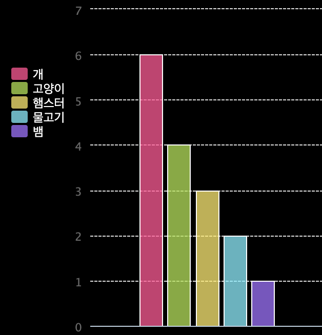
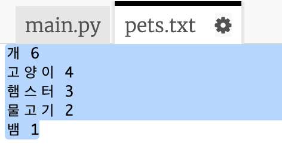
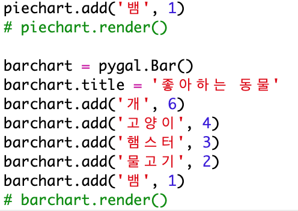
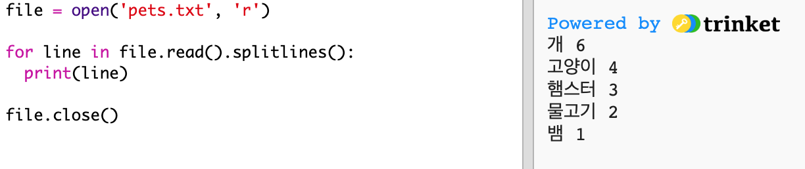

# 소개 {.intro}

이 프로젝트에서는 Code Club의 회원들에게 수집한 데이터를 기반으로 원형 차트와 막대 차트를 만듭니다.

  <iframe src="https://trinket.io/embed/python/9558134ed1?outputOnly=true&start=result" width="600" height="500" frameborder="0" marginwidth="0" marginheight="0" allowfullscreen>
  </iframe>
  

# 1단계: 원형 차트 만들기 {.activity}

원형 차트는 데이터를 보여줄 수 있는 유용한 방법입니다. Code Club에서 좋아하는 애완동물을 대상으로 설문 조사를 한 후 데이터를 원형 차트로 표현하세요.

## 활동 체크리스트 {.check}

+ 자원 봉사자에게 설문 조사를 도와달라고 요청하십시오. 누구나 볼 수 있는 프로젝터 또는 화이트 보드에 연결된 컴퓨터에 결과를 기록 할 수 있습니다.
    
    애완 동물의 목록을 작성하고 모두의 마음에 드는 애완동물을 리스트에 기록하세요.
    
    그런 다음 모든 사람들이 각 한 표씩 자신이 좋아하는 애완 동물에게 투표하세요. 한 표만!
    
    예를 들면:
    
    

+ 빈 파이썬 템플릿을 엽니다. <a href="http://jumpto.cc/python-new" target="_blank"> jumpto.cc/python-new</a>.

+ 설문 조사 결과를 보여주기 위해 원형 차트를 만듭니다. PyGal 라이브러리를 사용하여 개발하면 됩니다.
    
    먼저, Pygal 라이브러리를 import하세요:
    
    

+ 이제 원형 차트를 만들어 렌더링(표시) 합시다:
    
    
    
    데이터를 추가할 때 차트가 더 재미있어 질 것입니다!

+ 이제 애완 동물 중 하나에게 데이터를 추가합시다. 수집한 데이터를 사용하세요.
    
    
    
    데이터가 하나뿐이므로 전체 원형 차트를 사용합니다.

+ 이제 나머지 데이터를 같은 방식으로 추가하십시오.
    
    예를 들면:
    
    

+ 차트를 완성한 이후에는 title을 추가하세요:
    
    

## 프로젝트 저장하기 {.save}

## 과제: 자신만의 막대 차트 만들기 {.challenge}

비슷한 방식으로 막대형 차트를 만들 수 있습니다. `barchart = pygal.Bar()` 을 사용하여 새 barchart를 만든 다음 데이터를 추가하고 원형 차트와 같은 방식으로 렌더링합니다.

Code Club 회원의 데이터를 수집하여 자신만의 막대 그래프를 만드십시오.

모두가 알 만한 주제를 선택하십시오!

아래와 같은 아이디어를 제시할 수 있습니다:

+ 좋아하는 스포츠는 무엇입니까?

+ 좋아하는 아이스크림 맛은 무엇입니까?

+ 학교에 어떻게 갑니까?

+ 생일이 몇월 인가요?

+ 마인크래프트를 플레이하나요? (네/아니오)

사람들이 사는 곳과 같은 개인정보를 요구하는 질문을 하지 마세요. 잘 모르는 경우 클럽 리더에게 문의하십시오.

예시:

## 프로젝트 저장하기 {.save}

# 2단계: 파일에서 데이터 읽기 {.activity}

데이터를 코드에 포함하지 않고 파일에 데이터를 저장하는 것이 유용할 것입니다.

## 활동 체크리스트 {.check}

+ `pets.txt` 파일을 추가하세요:
    
    

+ 파일에 데이터를 추가하세요. 수집한 애완동물 데이터 또는 예제 데이터를 사용할 수 있습니다.
    
    

+ `main.py` 로 돌아와서 차트와 그래프를 렌더링(표시) 하는 라인을 주석 처리하세요. (표시되지 않도록):
    
    

+ 이제 파일에서 데이터를 읽도록 합니다.
    
    
    
    `for` 루프는 파일의 행을 반복합니다. `splitlines()` 은 줄의 끝에서 개행 문자를 제거합니다.

+ 각 줄은 레이블과 값으로 구분해야 합니다:
    
    
    
    공백이 있는 곳에서 줄바꿈하기 때문에 labels에 공백을 넣지 마십시오. (labels에 공백이 필요한 경우 나중에 추가 할 수 있습니다.)

+ 아래와 같은 에러가 발생할 수 있습니다:
    
    
    
    파일 끝에 빈 줄이 있으면 이런 일이 발생합니다.
    
    이 오류는 label과 value에 빈 데이터가 들어가지 않도록 하면 해결할 수 있습니다.
    
    오류를 해결하기 위해서, `for` 반복문 안에 `if line:` 코드를 추가하세요:
    
    

+ 이제 `print(label, value)` 을 삭제하셔도 됩니다.

+ 이제 label과 value를 새로운 원형 차트에 추가하고 렌더링 해 봅시다.
    
    
    
    참고로 `add`에 삽입되는 변수는 숫자로 입력 받으므로, `int(value)` 를 사용해서 문자열을 숫자로 변환할 수 있습니다.
    
    만약에 3.5와 같은 소수를 사용하고 싶다면 `float(value)`를 사용하시면 됩니다.

## 프로젝트 저장하기 {.save}

## 과제: 파일에서 새 차트 만들기 {.challenge}

파일의 데이터로 새로운 막대 그래프 또는 원형 차트를 만들 수 있습니까? 새로운 .txt 파일을 만들어야합니다.

팁: labels에 공백을 넣으려면 `line.split(': ')`로 데이터 파일에 콜론을 추가할 수 있습니다. (예시: 'Red Admiral : 6').

## 프로젝트 저장하기 {.save}

## 도전 과제: 더 많은 차트와 그래프! {.challenge}

같은 파일에서 파이 차트와 막대 차트를 만들 수 있습니까? 이전에 수집 한 데이터를 사용하거나 새로운 데이터를 수집 할 수 있습니다.

## 프로젝트 저장하기 {.save}