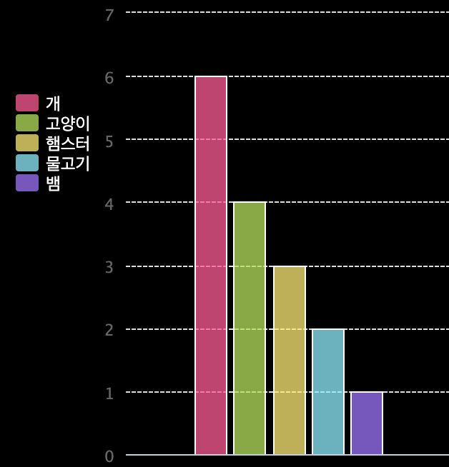

## 소개

이 프로젝트에서는 Code Club의 회원들에게 수집한 데이터를 기반으로 원형 차트와 막대 차트를 만듭니다.

### 설명

Run을 클릭하면 PyGal python 모듈을 기반으로 차트가 생성됩니다.

  <iframe src="https://trinket.io/embed/python/70d24d92b8?outputOnly=true&start=result" width="600" height="500" frameborder="0" marginwidth="0" marginheight="0" allowfullscreen>
  </iframe>
  

### 배울 지식

이 프로젝트는 [라즈베리파이 디지털 만들기 커리큘럼](http://rpf.io/curriculum) 중 아래의 과정에 있는 요소들을 다룹니다.

+ [프로그래밍 구조를 결합하여 문제 해결하기](https://www.raspberrypi.org/curriculum/programming/builder/)

### 교사들을 위한 부가 설명

이 프로젝트를 인쇄한다면 [프린트용 버전](https://projects.raspberrypi.org/en/projects/popular-pets/print){:target="_blank"}을 사용해 주십시오.

아래쪽에 있는 이 프로젝트를 위한 GitHub repository 링크를 이용하세요. (완성된 프로젝트 예제를 포함한) 모든 리소스가 'en/resources' 폴더에 들어 있습니다.