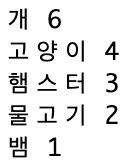

## 원형 차트 만들기

원형 차트는 데이터를 보여주는 유용한 방법입니다. Code Club에서 좋아하는 애완동물을 대상으로 설문 조사를 한 후 데이터를 원형 차트로 표현하세요.

+ 자원 봉사자에게 설문 조사를 도와달라고 요청하십시오. 누구나 볼 수 있는 프로젝터 또는 화이트 보드에 연결된 컴퓨터에 결과를 기록 할 수 있습니다.
    
    애완 동물의 목록을 작성하고 모두의 마음에 드는 애완동물을 리스트에 기록하세요.
    
    그런 다음 모든 사람들이 각 한 표씩 자신이 좋아하는 애완 동물에게 투표하세요. 한 표만!
    
    예를 들면:
    
    

+ 공백의 파이썬 Trinket 템플릿을 엽니다. <a href="http://jumpto.cc/python-new" target="_blank"> jumpto.cc/python-new </a>

+ 설문 조사 결과를 보여주기 위해 원형 차트를 만듭니다. PyGal 라이브러리를 사용하여 개발하면 됩니다.
    
    먼저, Pygal 라이브러리를 import하세요:
    
    

+ 이제 원형 차트를 만들어 렌더링 (표시) 합시다:
    
    
    
    데이터를 추가할 때 차트가 더 재미있어 질 것입니다!

+ 이제 애완 동물 중 하나에게 데이터를 추가합시다. 수집한 데이터를 사용하세요.
    
    
    
    데이터가 하나뿐이므로 전체 원형 차트를 사용합니다.

+ 이제 나머지 데이터를 같은 방식으로 추가하십시오.
    
    예를 들면:
    
    

+ 차트를 완성한 이후에는 title을 추가하세요:
    
    