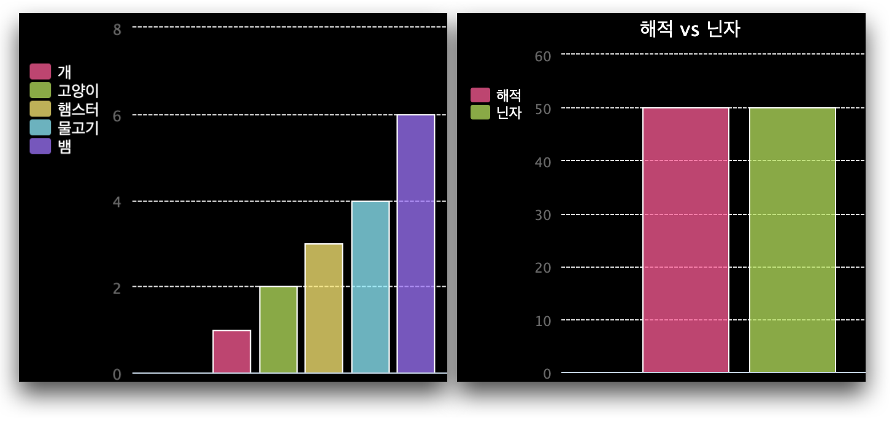

\--- challenge \---

## 과제: 자신만의 막대 차트 만들기

비슷한 방식으로 막대형 차트를 만들 수 있습니다. `barchart = pygal.Bar()` 을 사용하여 새 barchart를 만든 다음 데이터를 추가하고 원형 차트와 같은 방식으로 렌더링합니다.

Code Club 회원의 데이터를 수집하여 자신만의 막대 그래프를 만드십시오.

모두가 알 만한 주제를 선택하십시오!

아래와 같은 아이디어를 제시할 수 있습니다:

+ 좋아하는 스포츠는 무엇입니까?
+ 좋아하는 아이스크림 맛은 무엇입니까?
+ 학교에 어떻게 갑니까?
+ 몇월달이 생일인가요?
+ 마인크래프트를 플레이하나요? (네/아니오)

사람들이 사는 곳과 같은 개인정보를 요구하는 질문을 하지 마세요. 잘 모르는 경우 클럽 리더에게 문의하십시오.

예시:

\--- /challenge \---