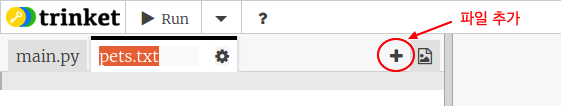
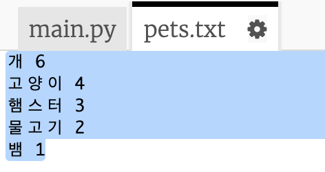
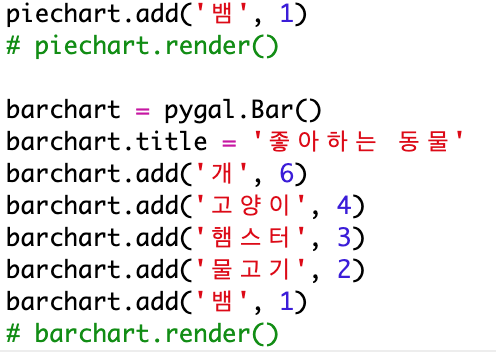
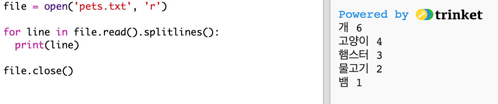
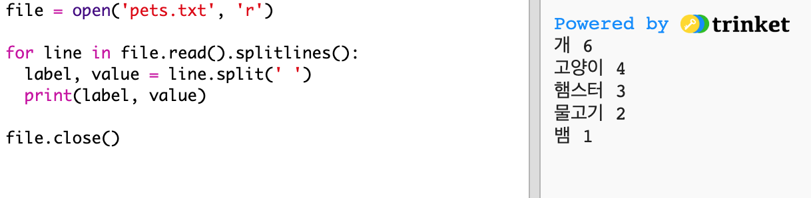
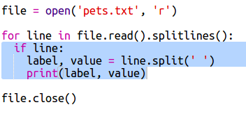
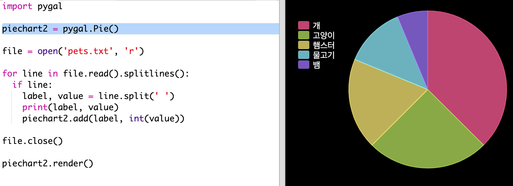

## 파일에서 데이터 읽기

데이터를 코드에 포함하지 않고 파일에 데이터를 저장할 수 있다면 더 유용할 것입니다.

+ `pets.txt` 파일을 추가하세요:
    
    

+ 파일에 데이터를 추가하세요. 수집한 애완동물 데이터 또는 예제 데이터를 사용할 수 있습니다.
    
    

+ `main.py` 로 돌아와서 차트와 그래프를 렌더링(표시) 하는 라인을 주석 처리하세요. (표시되지 않도록):
    
    

+ 이제 파일에서 데이터를 읽도록 합니다.
    
    
    
    `for` 루프는 파일의 행을 반복합니다. `splitlines()` 은 줄의 끝에서 개행 문자를 제거합니다.

+ 각 줄은 label과 value로 구분해야 합니다:
    
    
    
    공백이 있는 곳에서 줄바꿈하기 때문에 label들에 공백을 넣지 마십시오. (label들에 공백이 필요한 경우 나중에 추가 할 수 있습니다.)

+ 아래와 같은 에러가 발생할 수 있습니다:
    
    
    
    파일 끝에 빈 줄이 있으면 이런 일이 발생합니다.
    
    이 오류는 label과 value에 빈 데이터가 들어가지 않도록 하면 해결할 수 있습니다.
    
    오류를 해결하기 위해서, `for` 반복문 안에 `if line:` 코드를 추가하세요:
    
    

+ 이제 `print(label, value)` 을 삭제하셔도 됩니다.

+ 이제 label과 value를 새로운 원형 차트에 추가하고 렌더링 해 봅시다.
    
    
    
    참고로 `add`에 삽입되는 변수는 숫자로 입력 받으므로, `int(value)` 를 사용해서 문자열을 숫자로 변환할 수 있습니다.
    
    만약에 3.5와 같은 소수를 사용하고 싶다면 `float(value)`를 사용하시면 됩니다.