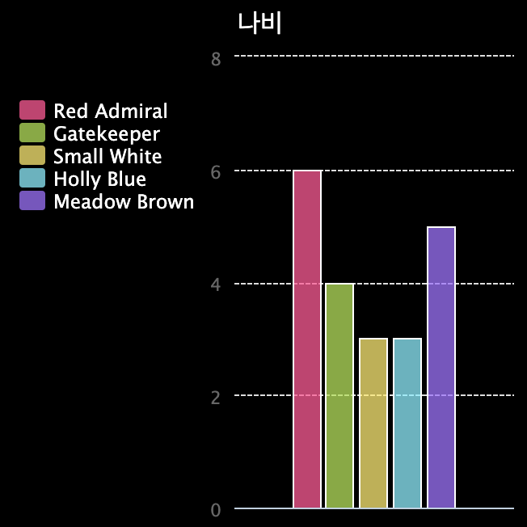

\--- challenge \---

## 도전 과제: 파일에서 새 차트 만들기

파일의 데이터로 새로운 막대 그래프 또는 원형 차트를 만들 수 있습니까? 새로운 .txt 파일을 만들어야합니다.

팁: label들에 공백을 넣으려면 `line.split(': ')`로 데이터 파일에 콜론을 추가할 수 있습니다. (예시: 'Red Admiral : 6').

\--- /challenge \---