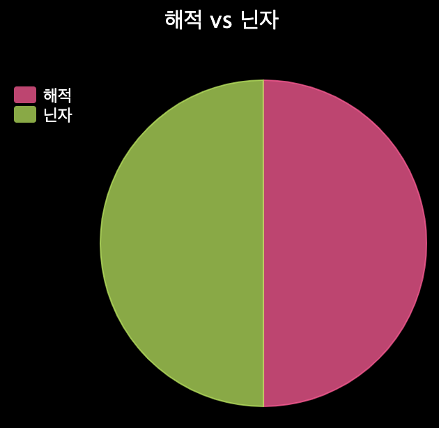

\--- 도전 \---

## Challenge: More charts and graphs!

Can you create a pie chart and a bar chart from the same file? You can either use the data you collected earlier or collect some new data.

<0>for</0>, <0>forward()</0>, <0>penup()</0> and <0>pendown()</0>를 사용해 보세요.