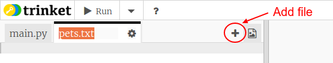

# Uvod {.intro}

U ovom projektu izradićeš kružne i stubičaste grafikone od podataka koje prikupiš od članova svog Code Cluba.

  <iframe src="https://trinket.io/embed/python/70d24d92b8?outputOnly=true&start=result" width="600" height="500" frameborder="0" marginwidth="0" marginheight="0" allowfullscreen>
  </iframe>
  

# Korak 1: Izradi kružni grafikon {.activity}

Kružni grafikoni su koristan način prikazivanja podataka. Sprovedimo anketu o omiljenim kućnim ljubimcima u tvom Code Clubu, a zatim prikažimo podatke u obliku kružnog grafikona.

## Zadaci {.check}

+ Zamoli svog volontera da ti pomogne u organizovanju ankete. Rezultate možeš da zabilježiš na računaru povezanom sa projektorom ili na tabli, tako da svi mogu da ih vide.
    
    Napiši spisak kućnih ljubimaca i pobrini se da na spisku budu svi omiljeni ljubimci učesnika ankete.
    
    Zatim neka svako glasa za svog omiljenog ljubimca tako što će podići ruku kada bude prozvan taj ljubimac. Svako glasa samo jednom!
    
    Na primjer:
    
    

+ Otvori prazan Python šablon u Trinketu: <a href="http://jumpto.cc/python-new" target="_blank">jumpto.cc/python-new</a>.

+ Izradimo kružni grafikon u kojem će biti prikazani rezutati tvoje ankete. Koristićeš PyGal biblioteku za neke teže dijelove.
    
    Prvo uvezi Pygal biblioteku:
    
    

+ Sada napravimo kružni grafikon i vizuelizujmo ga (prikažimo ga):
    
    
    
    Ne brini, biće zanimljiviji kada dodaš podatke!

+ Dodajmo podatke za jednog od ljubimaca. Koristi podatke koje si prikupio/prikupila.
    
    
    
    Pošto smo unijeli samo jedan podatak, on zauzima čitav kružni grafikon.

+ Sada na isti način dodaj ostale podatke.
    
    Na primjer:
    
    

+ Dodaj naslov da dovršiš svoj grafikon:
    
    

## Sačuvaj svoj projekat {.save}

## Izazov: Izradi sopstveni stubičasti grafikon {.challenge}

Na sličan način možeš da izrađuješ stubičaste grafikone. Jednostavno koristi `stubicastigraf = pygal.Bar()` za kreiranje novog stubičastog grafikona, a zatim unesi i prikaži podatke na isti način kao za kružni grafikon.

Za izradu svog stubičastog grafikona prikupi podatke od članova svog Code Cluba.

Pobrini se da odabereš temu koja će biti poznata svima!

Evo nekoliko ideja:

+ Koji je tvoj omiljeni sport?

+ Koji je tvoj omiljeni ukus sladoleda?

+ Kako dolaziš u školu?

+ U kojem mjesecu si rođen/rođena?

+ Igraš li Minecraft? (da/ne)

Ne postavljaj pitanja u kojima se traže lični podaci, kao što je adresa. Ako nisi siguran/sigurna koja pitanja da postaviš, pitaj vođu svog kluba.

Primjeri:

## Sačuvaj svoj projekat {.save}

# Korak 2: Čitaj podatke iz datoteke {.activity}

Umjesto da upisuješ podatke u svoj kôd, korisnije je da ih smjestiš u datoteku.

## Zadaci {.check}

+ Dodaj novu datoteku u svoj projekat i nazovi je `ljubimci.txt`:
    
    

+ Sada upiši podatke u datoteku. Možeš da koristiš podatke o omiljenim ljubimcima koje si prikupio/prikupila ili podatke iz primjera.
    
    

+ Pređi na `main.py` i komentariši redove koji vizuelizuju (prikazuju) grafikone (tako da ne budu prikazani):
    
    

+ Sada učitajmo podatke iz datoteke.
    
    
    
    Petlja `for` će prolaziti kroz sve redove u datoteci. Funkcija `splitlines()` uklanja znak za novi red sa kraja reda, pošto to ne želimo.

+ Svaki red mora biti podijeljen na naziv i vrijednost:
    
    
    
    Ovo će podijeliti red tamo gdje su razmaci, pa nemoj unositi razmake u nazive. (Kasnije možeš da dodaš opciju za razmake u nazivima.)

+ Možda ćeš dobiti poruku o grešci kao što je ova:
    
    
    
    To se dešava ako na kraju svoje datoteke imaš prazan red.
    
    Grešku možeš ispraviti tako da se naziv i vrijednost ispisuju samo ako red nije prazan.
    
    Da to napraviš, uvuci kôd unutar svoje `for` petlje i dodaj kôd `if red:` iznad njega:
    
    

+ Sada kada sve funkcioniše, možeš da ukloniš red `print(naziv, vrijednost)`.

+ Sada dodajmo naziv i vrijednost novom stubičastom grafikonu i prikažimo ga:
    
    
    
    Imaj u vidu da `add` očekuje da vrijednost bude broj, a `int(vrijednost)` pretvara vrijednost iz znakovnog niza u integer.
    
    Ako želiš da koristiš decimalne brojeve kao što je 3.5 (broj sa pokretnom tačkom), možeš da koristiš `float(vrijednost)`.

## Sačuvaj svoj projekat {.save}

## Izazov: Izradi novi grafikon od podataka iz datoteke {.challenge}

Možeš li da izradiš novi stubičasti ili kružni grafikon koristeći podatke iz datoteke? Biće potrebno da kreiraš novu .txt datoteku.

Savjet: Ako želiš da imaš razmake u nazivima, koristi `red.split(': ')` i dodaj dvotačke u svoje podatke u datoteci, na primjer 'Crveni admiral: 6'.

## Sačuvaj svoj projekat {.save}

## Izazov: Još grafikona! {.challenge}

Možeš li da izradiš kružni i stubičasti grafikon koristeći podatke iz iste datoteke? Možeš da koristiš već prikupljene podatke ili da prikupiš nove.

## Sačuvaj svoj projekat {.save}