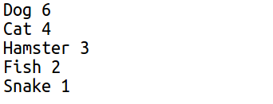

## Izradi kružni grafikon

Kružni grafikoni su koristan način prikazivanja podataka. Sprovedimo anketu o omiljenim kućnim ljubimcima u tvom Code Clubu, a zatim prikažimo podatke u obliku kružnog grafikona.

+ Zamoli vođu svog kluba da ti pomogne u organizovanju ankete. Rezultate možeš da zabilježiš na računaru povezanom sa projektorom ili na tabli, tako da svi mogu da ih vide.
    
    Napiši spisak kućnih ljubimaca i pobrini se da na spisku budu svi omiljeni ljubimci učesnika ankete.
    
    Zatim neka svako glasa za svog omiljenog ljubimca tako što će podići ruku kada bude prozvan taj ljubimac. Svako glasa samo jednom!
    
    Na primjer:
    
    

+ Otvori prazan Python šablon u Trinketu: <a href="http://jumpto.cc/python-new" target="_blank">jumpto.cc/python-new</a>.

+ Izradimo kružni grafikon u kojem će biti prikazani rezutati tvoje ankete. Koristićeš PyGal biblioteku za neke teže dijelove.
    
    Prvo uvezi Pygal biblioteku:
    
    

+ Sada napravimo kružni grafikon i vizuelizujmo ga (prikažimo ga):
    
    
    
    Ne brini, biće zanimljiviji kada dodaš podatke!

+ Dodajmo podatke za jednog od ljubimaca. Koristi podatke koje si prikupio/prikupila.
    
    
    
    Pošto smo unijeli samo jedan podatak, on zauzima čitav kružni grafikon.

+ Sada na isti način dodaj ostale podatke.
    
    Na primjer:
    
    

+ Dodaj naslov da dovršiš svoj grafikon:
    
    