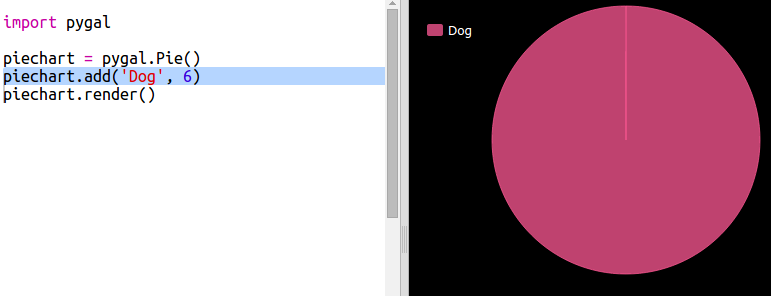
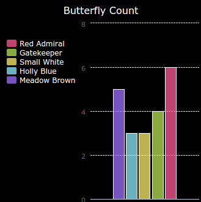

# परिचय {.intro}

या प्रकल्पात आपण आपल्या कोड क्लबच्या सदस्यांकडून संकलित केलेल्या डेटावरून पाय चार्ट आणि बार आलेख तयार करता.

  <iframe src="https://trinket.io/embed/python/70d24d92b8?outputOnly=true&start=result" width="600" height="500" frameborder="0" marginwidth="0" marginheight="0" allowfullscreen>
  </iframe>
  

# चरण 1: एक पाय चार्ट तयार करा {.activity}

पाय चार्ट हा डेटा दर्शविण्याचा उपयुक्त मार्ग आहे. चला आपल्या कोड क्लबमध्ये आवडत्या पाळीव प्राण्यांचे सर्वेक्षण करू आणि नंतर पाई चार्ट म्हणून डेटा सादर करू.

## एक्टिविटी चेकलिस्ट {.check}

+ सर्वेक्षण आयोजित करण्यासाठी आपल्या स्वयंसेवकांना सांगा. आपण प्रोजेक्टरशी जोडलेल्या संगणकावर किंवा प्रत्येकजणास पाहू शकणार्‍या व्हाईटबोर्डवर परिणाम रेकॉर्ड करू शकता.
    
    पाळीव प्राण्यांची सूची लिहा आणि प्रत्येकाच्या आवडीचा समावेश असल्याची खात्री करा.
    
    मग प्रत्येकाला जेव्हा हाक मारली जाते तेव्हा हात वर करुन त्यांच्या आवडीसाठी मतदान करा. प्रत्येकी फक्त एक मत!
    
    उदाहरणार्थ:
    
    

+ रिकामा Python टेंप्लेट Trinket उघडा: <a href="http://jumpto.cc/python-new" target="_blank">jumpto.cc/python-new</a>.

+ आपल्या सर्वेक्षणांचे निकाल दर्शविण्यासाठी पाय चार्ट तयार करूया. आपण काही मेहनत करण्यासाठी PyGal लायब्ररी वापरत आहात.
    
    पहिले पायगल लायब्ररी आयात करा:
    
    

+ आता एक पाय चार्ट तयार करू आणि प्रदर्शित करु:
    
    
    
    काळजी करू नका, जेव्हा आपण डेटा जोडता तेव्हा ते अधिक मनोरंजक होते!

+ चला पाळीव प्राण्यांपैकी एकासाठी डेटा जोडू. आपण संकलित केलेला डेटा वापरा.
    
    
    
    डेटाचा फक्त एक भाग आहे म्हणून तो संपूर्ण पाय चार्ट घेते.

+ आता उर्वरित डेटा त्याच प्रकारे जोडा.
    
    उदाहरणार्थ:
    
    

+ आणि आपला चार्ट पूर्ण करण्यासाठी, शीर्षक जोडा:
    
    

## आपला प्रकल्प संरक्षित(save) करा {.save}

## आव्हान: आपला स्वतःचा बार चार्ट तयार करा {.challenge}

आपण अशाच प्रकारे बार चार्ट तयार करू शकता. नवीन बारकार्ट तयार करण्यासाठी फक्त `barchart = pygal.Bar()` वापरा आणि नंतर डेटा जोडा आणि पाय चार्ट प्रमाणेच प्रस्तुत करा.

आपला स्वतःचा बार ग्राफ तयार करण्यासाठी आपल्या कोड क्लब सदस्यांकडून डेटा संकलित करा.

याची खात्री करा की आपण असा विषय निवडला आहे ज्याबद्दल प्रत्येकाला माहित असेल!

येथे काही संकल्पना आहेतः:

+ तुझा आवडता खेळ कोणता?

+ तुमचा आवडता आईस्क्रीम चव (flavour) काय आहे?

+ तूम्ही शाळेत कसे जाता?

+ आपला वाढदिवस कोणत्या महिन्यात आहे?

+ आपण Minecraft खेळता का? (होय/नाही)

असे प्रश्न विचारू नका जे वैयक्तिक डेटा देतात जसे की लोक कुठे राहतात. आपल्याला खात्री नसल्यास आपल्या क्लब प्रमूखाला विचारा.

उदाहरणे:

## आपला प्रकल्प संरक्षित(save) करा {.save}

# चरण 2: फाईलमधील डेटा वाचा {.activity}

आपल्या कोडमध्ये समाविष्ट करण्याऐवजी फाईलमध्ये डेटा संग्रहित करण्यास सक्षम असणे उपयुक्त आहे.

## एक्टिविटी चेकलिस्ट {.check}

+ आपल्या प्रोजेक्टमध्ये एक नवीन फाईल जोडा आणि त्यास `pets.txt` काॅल करा:
    
    

+ आता फाईलमध्ये डेटा जोडा. आपण संकलित केलेला आवडता पाळीव प्राणी डेटा किंवा उदाहरणार्थ डेटा वापरू शकता.
    
    

+ ` main.py` वर परत स्विच करा आणि चार्ट आणि आलेख प्रस्तुत करणार्‍या रेषांवर टिप्पणी द्या (जेणेकरुन ते प्रदर्शित होणार नाहीत):
    
    

+ आता फाईलमधील डेटा वाचू.
    
    
    
    `for` लूप फाईलमधील रेषांवर लूप करेल. `splitlines()` आपल्याला नको नसल्यामुळे ओळीच्या शेवटीचे न्यूलाइन वर्ण काढून टाकते.

+ प्रत्येक ओळ एक लेबल आणि मूल्य मध्ये विभक्त करणे आवश्यक आहे:
    
    
    
    हे रिक्त स्थानांवर रेषा विभाजित करेल म्हणून लेबलांमध्ये रिक्त स्थान समाविष्ट करू नका. (आपण नंतर लेबलांमधील मोकळ्या जागांसाठी समर्थन जोडू शकता.)

+ आपणास यासारखी त्रुटी येऊ शकते:
    
    
    
    आपल्या फाईलच्या शेवटी आपल्यास रिकामी ओळ असल्यास हे होईल.
    
    लाइन रिक्त नसल्यास केवळ लेबल आणि मूल्य मिळवून आपण त्रुटी दूर करू शकता.
    
    हे करण्यासाठी, आपल्या `for`कोडमध्ये प्रवेश करा लूप आणि कोड जोडा `if line:` या वर:
    
    

+ आपण `print(label, value)` ओळ काढू शका. आता सर्वकाही कार्यरत आहे.

+ आता आपण नवीन पाय चार्टमध्ये लेबल आणि मूल्य जोडू आणि त्यास प्रस्तुत करूया:
    
    
    
    `add` मूल्य एक संख्या असल्याचे अपेक्षित आहे, `int(value)` स्ट्रिंगमधून मूल्य पूर्णांकात बदलते.
    
    आपण 3.5 (फ्लोटिंग पॉईंट नंबर) सारखे दशांश वापरू इच्छित असल्यास आपण `float(value)` वापरू शकता.

## आपला प्रकल्प संरक्षित(save) करा {.save}

## आव्हान: फाईलमधून एक नवीन चार्ट तयार करा {.challenge}

आपण फाईलमधील डेटामधून नवीन बार ग्राफ किंवा पाई चार्ट तयार करू शकता? आपल्याला एक नवीन .txt फाइल तयार करण्याची आवश्यकता असेल.

टीपः जर आपल्याला लेबलांमध्ये मोकळी जागा पाहिजे असेल तर `line.split(':')` वापरा आणि आपल्या डेटा फाइलमध्ये कोलोन जोडा, उदा. 'Red Admiral: 6'

## आपला प्रकल्प जतन करा {.save}

## आव्हान: अधिक चार्ट आणि आलेख! {.challenge}

आपण त्याच फाईलमधून पाय चार्ट आणि बार चार्ट तयार करू शकता? आपण एकतर आपण पूर्वी गोळा केलेला डेटा वापरू शकता किंवा काही नवीन डेटा संकलित करू शकता.

## आपला प्रकल्प संरक्षित(save) करा {.save}