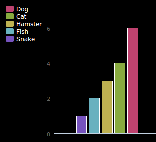

## परिचय

या प्रकल्पात आपण आपल्या कोड क्लबच्या सदस्यांकडून संकलित करता त्या डेटावरून पाय चार्ट आणि बार आलेख तयार कराल.

### सूचना

जेव्हा आपण रन क्लिक करा पायगल(pyGal) पायथन मॉड्यूल वापरुन डेटामधून चार्ट व्युत्पन्न केले जातात.

  <iframe src="https://trinket.io/embed/python/70d24d92b8?outputOnly=true&start=result" width="600" height="500" frameborder="0" marginwidth="0" marginheight="0" allowfullscreen>
  </iframe>
  

### तुम्हाला काय शिकायला मिळेल

या प्रकल्पात [​​Raspberry Pi Digital Making Curriculum](http://rpf.io/curriculum) च्या खालील घटक समाविष्ट आहेत:

+ [समस्या सोडवण्यासाठी एकत्र प्रोग्रामिंग संकल्पना.](https://www.raspberrypi.org/curriculum/programming/builder/)

### शिक्षकांसाठी अतिरिक्त माहिती

तुम्हाला हा प्रोजेक्ट प्रिंट करणे आवश्यक असल्यास, कृपया [प्रिन्टर अनुकूल आवृत्ती](https://projects.raspberrypi.org/mr-IN/projects/popular-pets/print){:target="_blank"} वापरा.

या प्रकल्पाचे GitHub repository वर प्रवेश करण्यासाठी फूटरमध्ये दिलेले link वापरा, ज्यात 'mr-IN/resources' फोल्डरमध्ये सर्व संसाधने (व उदाहरणार्थ पूर्ण झालेले प्रकल्प) समाविष्ट आहे.