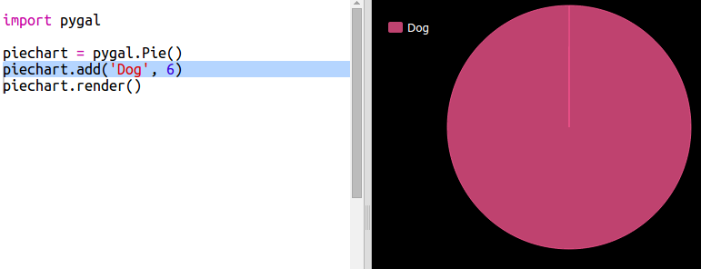

## एक पाय चार्ट तयार करा

पाय चार्ट हा डेटा दर्शविण्याचा उपयुक्त मार्ग आहे. चला आपल्या कोड क्लबमध्ये आवडत्या पाळीव प्राण्यांचे सर्वेक्षण करू आणि नंतर पाई चार्ट म्हणून डेटा सादर करू.

+ आपल्या क्लब प्रमुखाला सर्वेक्षण आयोजित करण्यात मदत करण्यास सांगा. आपण प्रोजेक्टरशी जोडलेल्या संगणकावर किंवा प्रत्येकजणास पाहू शकणार्‍या व्हाईटबोर्डवर परिणाम रेकॉर्ड करू शकता.
    
    पाळीव प्राण्यांची सूची लिहा आणि प्रत्येकाच्या आवडीचा समावेश असल्याची खात्री करा.
    
    मग प्रत्येकाला जेव्हा हाक मारली जाते तेव्हा हात वर करुन त्यांच्या आवडीसाठी मतदान करा. प्रत्येकी फक्त एक मत!
    
    उदाहरणार्थ:
    
    

+ रिकामा Python टेंप्लेट Trinket उघडा: <a href="http://jumpto.cc/python-new" target="_blank">jumpto.cc/python-new</a>.

+ आपल्या सर्वेक्षणांचे निकाल दर्शविण्यासाठी पाय चार्ट तयार करूया. आपण काही काम करण्यासाठी पायगल (PyGal) लायब्ररी वापरत आहात.
    
    पहिले Pygal लायब्ररी आयात करा:
    
    

+ आता एक पाय चार्ट तयार करू आणि प्रदर्शित करु:
    
    
    
    काळजी करू नका, जेव्हा आपण डेटा जोडता तेव्हा ते अधिक मनोरंजक होते!

+ चला पाळीव प्राण्यांपैकी एकासाठी डेटा जोडू. आपण संकलित केलेला डेटा वापरा.
    
    
    
    डेटाचा फक्त एक तुकडा आहे म्हणून तो संपूर्ण पाय चार्ट घेते.

+ आता उर्वरित डेटा त्याच प्रकारे जोडा.
    
    उदाहरणार्थ:
    
    

+ आणि आपला चार्ट पूर्ण करण्यासाठी, शीर्षक जोडा:
    
    