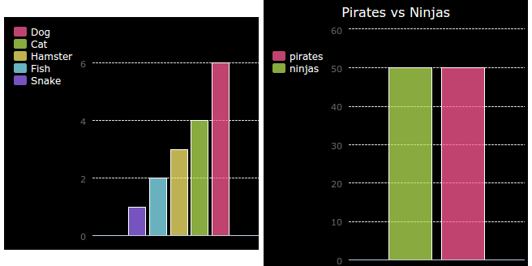

--- challenge ---

## आव्हान: आपला स्वतःचा बार चार्ट तयार करा

आपण अशाच प्रकारे बार चार्ट तयार करू शकता. फक्त `barchart = pygal.Bar()` वापरा. नवीन बारकार्ट तयार करण्यासाठी आणि नंतर डेटा जोडा आणि पाय चार्ट प्रमाणेच प्रस्तुत करा.

आपला स्वतःचा बार ग्राफ तयार करण्यासाठी आपल्या कोड क्लब सदस्यांकडून डेटा संकलित करा.

याची खात्री करा की आपण असा विषय निवडला आहे ज्याबद्दल प्रत्येकाला माहित असेल!

येथे काही कल्पना आहेतः

+ तुझा आवडता खेळ कोणता?
+ तुमचा आवडता आईस्क्रीम चव (flavour) काय आहे?
+ तूम्ही शाळेत कसे जाता?
+ आपला वाढदिवस कोणत्या महिन्यात आहे?
+ आपण Minecraft खेळता का? (होय/नाही)

असे प्रश्न विचारू नका जे वैयक्तिक डेटा देतात जसे की लोक कुठे राहतात. आपल्याला खात्री नसल्यास आपल्या क्लब प्रमुखाला विचारा.

उदाहरणे:

--- /challenge ---