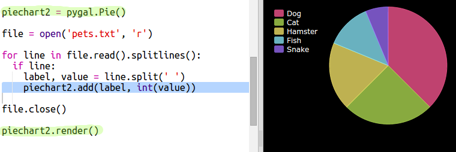

## फाईलमधील डेटा वाचा

आपल्या कोडमध्ये समाविष्ट करण्याऐवजी फाईलमध्ये डेटा संग्रहित करण्यास सक्षम असणे उपयुक्त आहे.

+ आपल्या प्रोजेक्टमध्ये एक नवीन फाईल जोडा आणि त्यास `pets.txt` नाव द्या:
    
    

+ आता फाईलमध्ये डेटा जोडा. आपण संकलित केलेला आवडता पाळीव प्राणी डेटा किंवा उदाहरणार्थ डेटा वापरू शकता.
    
    

+ `main.py` वर परत स्विच करा आणि चार्ट आणि आलेख प्रस्तुत करणार्‍या रेषांवर टिप्पणी द्या (जेणेकरुन ते प्रदर्शित होणार नाहीत):
    
    

+ आता फाईलमधील डेटा वाचू.
    
    
    
    `for` लूप फाईलमधील रेषांवर लूप येईल. `splitlines()` आपल्याला नको नसल्यामुळे ओळीच्या शेवटीचे न्यूलाइन कॅरेक्टर काढून टाकते.

+ प्रत्येक ओळ एक लेबल आणि मूल्य मध्ये विभक्त करणे आवश्यक आहे:
    
    
    
    हे रिक्त स्थानांवर रेषा विभाजित करेल म्हणून लेबलांमध्ये रिक्त स्थान समाविष्ट करू नका. (आपण नंतर लेबलांमधील मोकळ्या जागांसाठी समर्थन जोडू शकता.)

+ आपणास यासारखी त्रुटी येऊ शकते:
    
    
    
    आपल्या फाईलच्या शेवटी आपल्यास रिकामी ओळ असल्यास हे होईल.
    
    लाइन रिक्त नसल्यास केवळ लेबल आणि मूल्य मिळवून आपण त्रुटी दूर करू शकता.
    
    हे करण्यासाठी, आपल्या `for`कोडमध्ये प्रवेश करा लूप आणि कोड जोडा `if line:` या वर:
    
    

+ आपण `print(label, value)` ओळ आता सर्वकाही कार्यरत आहे.

+ आता आपण नवीन पाय चार्टमध्ये लेबल आणि मूल्य जोडू आणि त्यास प्रस्तुत करूया:
    
    
    
    `add` मूल्य एक संख्या असल्याचे अपेक्षित आहे, `int(value)` स्ट्रिंगमधून मूल्य पूर्णांकात बदलते.
    
    आपण 3.5 (फ्लोटिंग पॉईंट नंबर) सारखे दशांश वापरू इच्छित असल्यास आपण `float(value)`वापरू शकता.