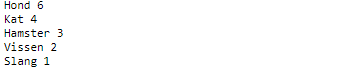
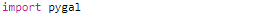
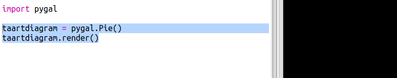
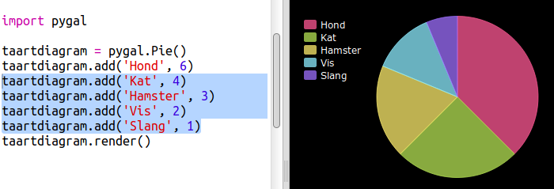
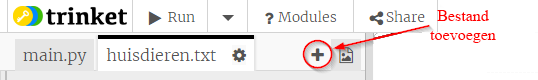
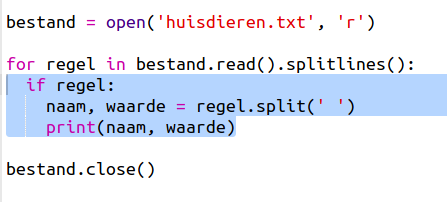
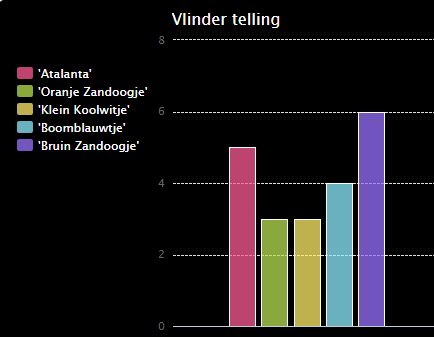

# Inleiding {.intro}

In dit project maak je taartdiagrammen en staafdiagrammen van gegevens die je van de leden van je Code Club verzamelt.

  <iframe src="https://trinket.io/embed/python/70d24d92b8?outputOnly=true&start=result" width="600" height="500" frameborder="0" marginwidth="0" marginheight="0" allowfullscreen>
  </iframe>
  

# Stap 1: Maak een taartdiagram {.activity}

Taartdiagrammen (ook wel cirkeldiagrammen genoemd) zijn een handige manier om gegevens weer te geven. Laten we een onderzoek doen naar de favoriete huisdieren in je Code Club om die gegevens daarna in een taartdiagram te laten zien.

## Activiteitenlijst {.check}

+ Vraag je vrijwilliger om een ​​enquête te houden. Je kunt de resultaten verzamelen op een computer die is aangesloten op een projector, of op een een whiteboard, zodat iedereen ze kan zien.
    
    Maak een lijst met huisdieren en zorg ervoor dat ieders favoriet erop staat.
    
    Laat dan iedereen stemmen op zijn favoriet door zijn hand op te steken als deze wordt genoemd. Slechts één stem per persoon!
    
    Bijvoorbeeld:
    
    

+ Open de lege Python-sjabloon Trinket: <a href="http://jumpto.cc/python-new" target="_blank">jumpto.cc/python-new</a>.

+ Laten we een taartdiagram maken om de resultaten van je enquête te tonen. Je zult de PyGal-bibliotheek gebruiken die een gedeelte van het moeilijke werk doet.
    
    Importeer eerst de Pygal-bibliotheek:
    
    

+ Laten we nu een taartdiagram maken en die renderen (weergeven):
    
    
    
    Maak je geen zorgen, het wordt interessanter als je de gegevens toevoegt!

+ Laten we de gegevens voor een van de huisdieren toevoegen. Gebruik de gegevens die je hebt verzameld.
    
    
    
    Er is slechts één gegeven, dus dat neemt het hele taartdiagram in beslag.

+ Voeg nu de rest van de gegevens op dezelfde manier toe.
    
    Bijvoorbeeld:
    
    

+ En om de ​​grafiek af te maken, voeg je een titel toe:
    
    

## Sla je project op {.save}

## Uitdaging: maak je eigen staafdiagram {.challenge}

Je kunt op dezelfde manier staafdiagrammen maken. Gebruik `staafdiagram = pygal.Bar()` om een ​​nieuw staafdiagram te maken, voeg vervolgens de gegevens toe en render deze op dezelfde manier als voor een taartdiagram.

Verzamel gegevens van je Code Club-leden om je eigen staafdiagram te maken.

Zorg ervoor dat je een onderwerp kiest dat bij iedereen bekend is!

Hier zijn enkele ideeën:

+ Wat is jouw favoriete sport?

+ Wat is je favoriete ijssmaak?

+ Hoe kom je op school?

+ Wanneer ben je jarig?

+ Speel jij Minecraft? (Ja/nee)

Stel geen vragen die persoonlijke gegevens bevatten, zoals waar mensen wonen. Vraag je clubleider als je het niet zeker weet.

Voorbeelden:

## Sla je project op {.save}

# Stap 2: lees gegevens uit een bestand {.activity}

Het is handig om gegevens in een bestand op te slaan in plaats van het in je code te moeten opnemen.

## Activiteitenlijst {.check}

+ Voeg een nieuw bestand toe aan je project en noem het `huisdieren.txt`:
    
    

+ Voeg nu gegevens toe aan het bestand. Je kunt de favoriete huisdiergegevens gebruiken die je hebt verzameld of de voorbeeldgegevens.
    
    

+ Schakel terug naar `main.py` en zet een hekje voor de regels die de diagrammen en grafieken renderen (weergeven) zodat ze niet worden weergegeven:
    
    

+ Nu kun je de gegevens uit het bestand lezen.
    
    
    
    De `for` lus loopt door de regels in het bestand. `splitlines ()` verwijdert het teken voor de volgende regel aan het einde van de regel, omdat je dat niet nodig hebt.

+ Elke regel moet worden gesplitst in een naam en een waarde:
    
    
    
    Hiermee wordt de regel op de spaties gesplitst, dus zet geen spaties in de naam. (Later kun je ondersteuning voor spaties in namen toevoegen.)

+ Je krijgt mogelijk de volgende foutmelding:
    
    
    
    Dit gebeurt als er een lege regel aan het einde van je bestand staat.
    
    Je kunt de fout oplossen door alleen de naam en de waarde op te halen als de regel niet leeg is.
    
    Daarvoor spring je binnen de `for` lus in en voeg je de code `if regel:` toe:
    
    

+ Je kunt, nu alles werkt, de regel `print(label, value)` verwijderen.

+ Laten we nu de naam en waarde toevoegen aan een nieuw taartdiagram en het renderen:
    
    
    
    Merk op dat `add` (toevoegen) verwacht dat de waarde een getal is, `int(waarde)` verandert de waarde van een string in een geheel getal.
    
    Als je decimalen zoals 3,5 (drijvendekommagetallen) wilt gebruiken, kun je in plaats daarvan `float(waarde)` gebruiken.

## Sla je project op {.save}

## Uitdaging: maak een nieuw diagram vanuit een bestand {.challenge}

Kun je een nieuw staaf- of taartdiagram maken op basis van gegevens in een bestand? Je moet een nieuw .txt-bestand maken.

Tip: als je spaties in de namen wilt hebben, gebruik je `regel.split(': ')` en voeg je dubbele punten toe aan je gegevensbestand, bijvoorbeeld 'Oranje Zandoogje': 6

## Sla je project op {.save}

## Uitdaging: meer taart- en staafdiagrammen! {.challenge}

Kun je van hetzelfde bestand een taartdiagram en een staafdiagram maken? Je kunt de eerder verzamelde gegevens gebruiken of nieuwe gegevens verzamelen.

## Sla je project op {.save}