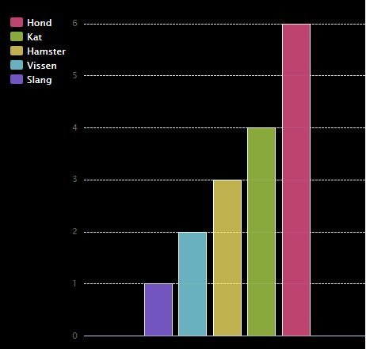

## Inleiding

In dit project maak je taart- en staafdiagrammen van gegevens die je verzamelt van leden van je Code Club.

### Instructies

Wanneer je op Run klikt, worden de diagrammen gegenereerd op basis van gegevens en met behulp van de PyGal python-module.

  <iframe src="https://trinket.io/embed/python/1db951f513?outputOnly=true&start=result" width="600" height="500" frameborder="0" marginwidth="0" marginheight="0" allowfullscreen>
  </iframe>
  

### Wat ga je leren

Dit project behandelt elementen uit de volgende onderdelen van het [Raspberry Pi Digital Making Curriculum](http://rpf.io/curriculum):

+ [Combineer programmeerconstructies om een ​​probleem op te lossen.](https://www.raspberrypi.org/curriculum/programming/builder/)

### Aanvullende informatie voor clubleiders

Als je dit project wilt afdrukken, gebruik dan de [ printvriendelijke versie ](https://projects.raspberrypi.org/en/projects/popular-pets/print) {:target="_ blank"}.

Gebruik de link in de voettekst voor toegang tot de GitHub opslagplaats voor dit project, met daarin alle bronnen (inclusief een voorbeeld van een voltooid project) in de map ' nl/bronnen'.