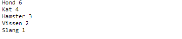
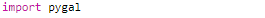
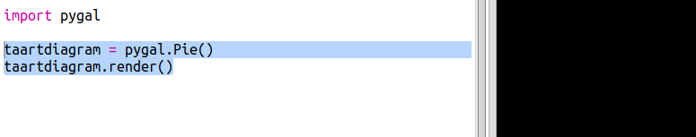
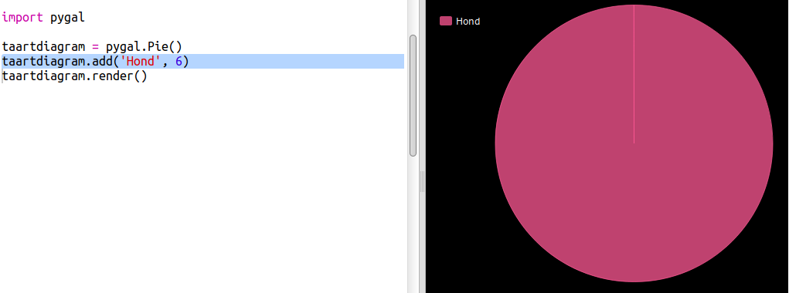
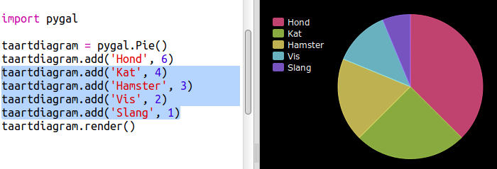
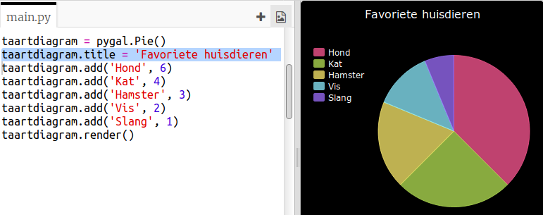

## Maak een taartdiagram

Taartdiagrammen zijn een handige manier om gegevens weer te geven. Laten we een onderzoek doen naar de favoriete huisdieren in je Code Club om die gegevens daarna in een taartdiagram te laten zien.

+ Vraag je clubleider om een ​​enquête te organiseren. Je kunt de resultaten verzamelen op een computer die is aangesloten op een projector of schrijven op een whiteboard zodat iedereen ze kan zien.
    
    Maak een lijst met huisdieren en zorg ervoor dat ieders favoriet erop staat.
    
    Laat iedereen dan stemmen op zijn of haar favoriet door de hand op te steken als het dier genoemd wordt. Slechts één stem per persoon!
    
    Bijvoorbeeld:
    
    

+ Open de lege Python-sjabloon Trinket: <a href="http://jumpto.cc/python-new" target="_blank">jumpto.cc/python-new</a>.

+ Laten we een taartdiagram maken om de resultaten van je enquête te tonen. Je zult de PyGal-bibliotheek gebruiken die een gedeelte van het moeilijke werk doet.
    
    Importeer eerst de Pygal-bibliotheek:
    
    

+ Laten we nu een taartdiagram maken en die renderen (weergeven):
    
    
    
    Maak je geen zorgen, het wordt interessanter als je gegevens toevoegt!

+ Laten we de gegevens voor een van de huisdieren toevoegen. Gebruik de gegevens die je hebt verzameld.
    
    
    
    Er is slechts één gegeven, dus dat neemt het hele taartdiagram in beslag.

+ Voeg nu de rest van de gegevens op dezelfde manier toe.
    
    Bijvoorbeeld:
    
    

+ En om de ​​grafiek af te maken, voeg je een titel toe:
    
    