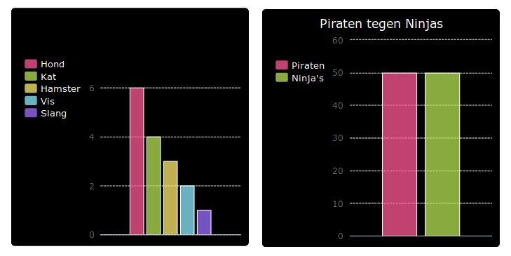

--- challenge ---

## Uitdaging: maak je eigen staafdiagram

Je kunt op dezelfde manier staafdiagrammen maken. Gebruik `staafdiagram = pygal.Bar()` om een ​​nieuw staafdiagram te maken, voeg vervolgens de gegevens toe en render deze op dezelfde manier als voor een taartdiagram.

Verzamel gegevens van je Code Club-leden om je eigen staafdiagram te maken.

Zorg ervoor dat je een onderwerp kiest dat bij iedereen bekend is!

Hier zijn enkele ideeën:

+ Wat is jouw favoriete sport?
+ Wat is je favoriete ijssmaak?
+ Hoe kom je op school?
+ In welke maand valt jouw verjaardag?
+ Speel jij Minecraft? (ja/nee)

Stel geen vragen die persoonlijke gegevens bevatten, zoals waar mensen wonen. Vraag je clubleider als je het niet zeker weet.

Voorbeelden:

--- /challenge ---