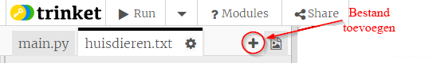
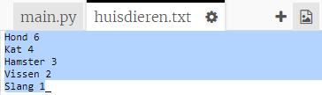
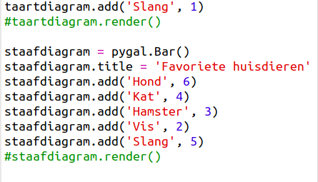
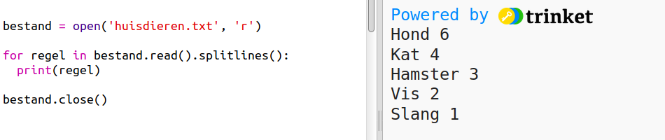
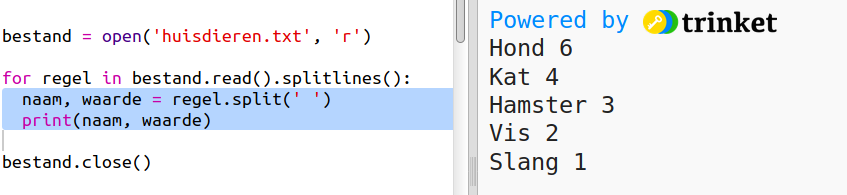
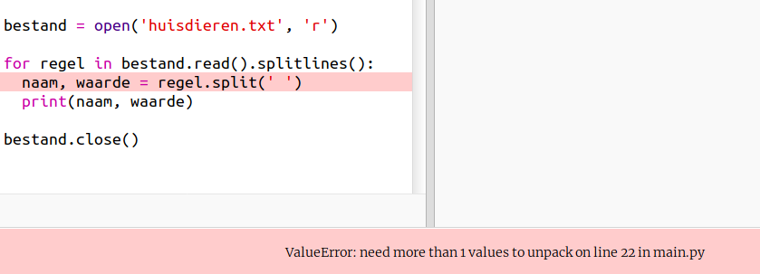
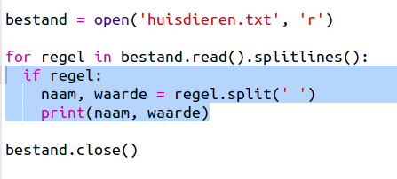
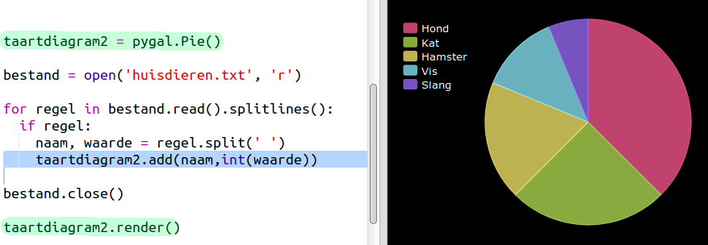

## Gegevens uit een bestand lezen

Het is handig om gegevens in een bestand op te slaan in plaats van het in je code te moeten opnemen.

+ Voeg een nieuw bestand toe aan je project en noem het `huisdieren.txt`:
    
    

+ Voeg nu gegevens toe aan het bestand. Je kunt de favoriete huisdiergegevens gebruiken die je hebt verzameld of de voorbeeldgegevens.
    
    

+ Schakel terug naar `main.py` en zet een hekje voor de regels die de diagrammen en grafieken renderen (weergeven) zodat ze niet worden weergegeven:
    
    

+ Laten we nu de gegevens uit het bestand lezen.
    
    
    
    De `for` lus doorloopt de regels in het bestand. `splitlines ()` verwijdert het teken voor de volgende regel aan het einde van de regel, omdat je dat niet nodig hebt.

+ Elke regel moet worden verdeeld in een naam (label) en een waarde:
    
    
    
    Hiermee wordt de regel op de spaties gesplitst, dus zet geen spaties in de naam. (Later kun je ondersteuning voor spaties in namen toevoegen.)

+ Je krijgt mogelijk de volgende foutmelding:
    
    
    
    Dit gebeurt als er een lege regel aan het einde van je bestand staat.
    
    Je kunt de fout oplossen door alleen de naam en de waarde op te halen als de regel niet leeg is.
    
    Daarvoor spring je binnen de `for` lus in en voeg je de code `if regel:` toe:
    
    

+ Je kunt, nu alles werkt, de regel `print(naam, waarde)` verwijderen.

+ Laten we nu de naam en waarde toevoegen aan een nieuw taartdiagram en het renderen:
    
    
    
    Merk op dat `add` (toevoegen) verwacht dat de waarde een getal is, `int(waarde)` verandert de waarde van een string in een geheel getal.
    
    Als je decimalen zoals 3,5 (drijvendekommagetallen) wilt gebruiken, kun je in plaats daarvan `float(waarde)` gebruiken.