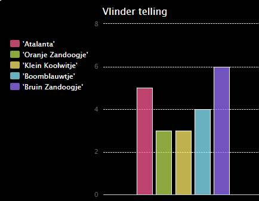

\--- uitdaging \---

## Uitdaging: maak een nieuw diagram vanuit een bestand

Kun je een nieuw staafdiagram of cirkeldiagram maken op basis van gegevens in een bestand? U moet een nieuw .txt-bestand maken.

Tip: als u spaties in de labels wilt hebben, gebruikt u `line.split (':')` en voegt u dubbele punten toe aan uw gegevensbestand, bijvoorbeeld 'Red Admiral: 6'

\--- / uitdaging \---