# Wprowadzenie {.intro}

W tym projekcie tworzysz wykresy kołowe i wykresy słupkowe na podstawie danych zbieranych od członków Twojego Code Club.

  <iframe src="https://trinket.io/embed/python/70d24d92b8?outputOnly=true&start=result" width="600" height="500" frameborder="0" marginwidth="0" marginheight="0" allowfullscreen>
  </iframe>
  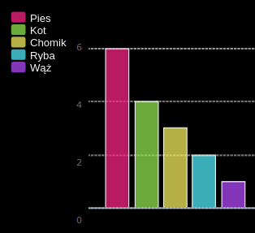

# Krok 1: Utwórz wykres kołowy {.activity}

Wykresy kołowe są użytecznym sposobem przedstawiania danych. Zróbmy ankietę ulubionych zwierzątek w twoim Code Club, a następnie przedstawmy je w postaci wykresu kołowego.

## Lista kontrolna aktywności {.check}

+ Poproś swojego wolontariusza o pomoc w zorganizowaniu ankiety. Możesz zapisywać wyniki na komputerze podłączonym do projektora lub na tablicy, którą każdy może zobaczyć.
    
    Napisz listę zwierzątek i upewnij się, że każdego ulubieńcy są uwzględnieni.
    
    Następnie niech każdy zagłosuje na swojego ulubieńca, podnosząc rękę jak zwierzątko będzie wyczytane. Ale każdy może zagłosować tylko raz!
    
    Na przykład:
    
    

+ Otwórz pusty szablon dla języka Python w edytorze Trinket: <a href="http://jumpto.cc/python-new" target="_blank">jumpto.cc/python-new</a>.

+ Stwórzmy wykres kołowy, aby pokazać wyniki Twojej ankiety. Będziesz używał biblioteki PyGal do wykonania ciężkiej pracy.
    
    Najpierw zaimportuj bibliotekę Pygal:
    
    

+ Teraz utwórzmy wykres kołowy i wyrenderujmy (wyświetlmy) go:
    
    
    
    Nie martw się, zrobi się ciekawiej, gdy dodasz dane!

+ Dodajmy dane dla jednego ze zwierzątek. Wykorzystaj zebrane dane.
    
    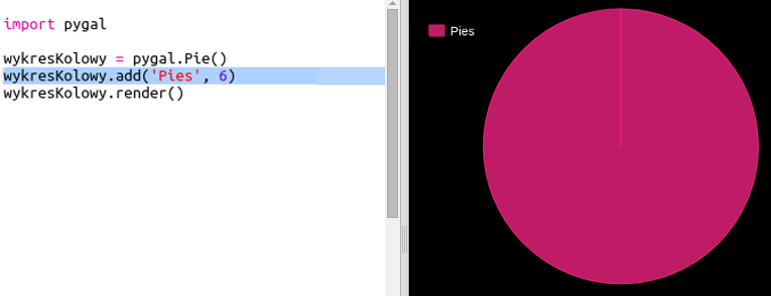
    
    Jest tylko jeden element danych, więc zajmuje cały wykres kołowy.

+ Teraz dodaj pozostałe dane w ten sam sposób.
    
    Na przykład:
    
    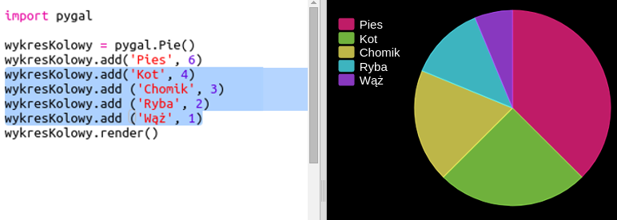

+ Aby ukończyć wykres, dodaj tytuł:
    
    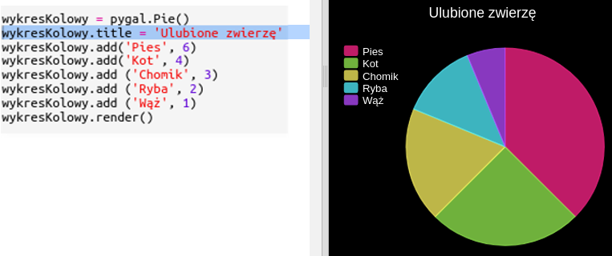

## Zapisz swój projekt {.save}

## Wyzwanie: Stwórz własny wykres słupkowy {.challenge}

Możesz tworzyć wykresy słupkowe w podobny sposób. Wystarczy użyć `wykresSlupokwy = pygal.Bar()` aby utworzyć nowy wykres słupkowy, a następnie dodać dane i renderować w taki sam sposób, jak w przypadku wykresu kołowego.

Zbierz dane od członków Code Club, aby stworzyć własny wykres słupkowy.

Upewnij się, że wybierasz temat, o którym wszyscy będą wiedzieć!

Oto kilka pomysłów:

+ Jaki jest Twój ulubiony sport?

+ Jaki jest twój ulubiony smak lodów?

+ Jak dostajesz się do szkoły?

+ W jakim miesiącu masz urodziny?

+ Czy grasz w Minecraft? (tak/nie)

Nie zadawaj pytań, które dają dane osobowe, takie jak miejsce zamieszkania innych. Zapytaj swojego lidera klubu, jeśli nie jesteś tego pewien.

Przykłady:

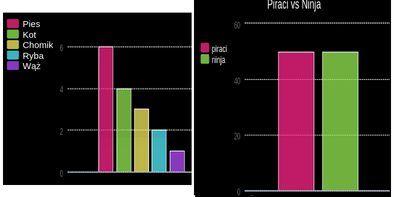

## Zapisz swój projekt {.save}

# Krok 2: Wczytaj dane z pliku {.activity}

Warto przechowywać dane w pliku, zamiast umieszczać je w kodzie.

## Lista kontrolna aktywności {.check}

+ Dodaj nowy plik do projektu i nazwij go `pets.txt`:
    
    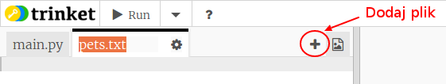

+ Teraz dodaj dane do pliku. Możesz użyć dane ulubionych zwierzątek, które zebrałeś, albo przykładowych danych.
    
    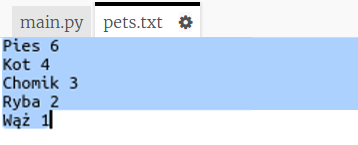

+ Przełącz z powrotem na `main.py` i zakomentuj linie renderujące (wyświetlające) wykresy (tak, aby nie były wyświetlane):
    
    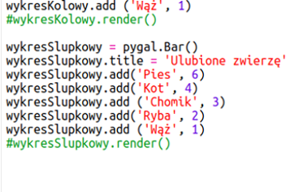

+ Teraz odczytajmy dane z pliku.
    
    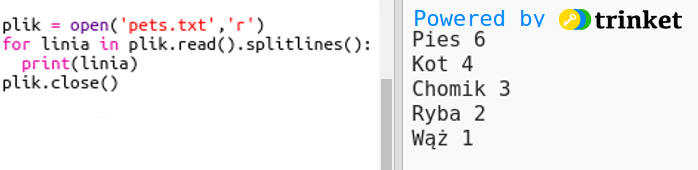
    
    Pętla `for` będzie powtarzać linie w pliku. `splitlines()` usuwa znak nowej linii z końca linii, ponieważ tego nie chcesz.

+ Każda linia musi być podzielona na etykietę(label) i wartość(value):
    
    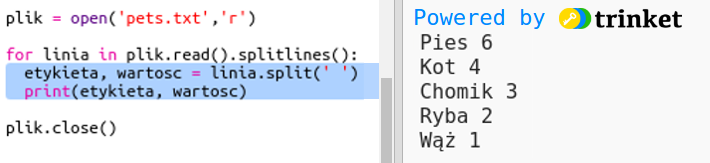
    
    Spowoduje to podzielenie linii w miejscach spacji, więc nie używaj spacji w etykietach. (Możesz dodać wspieranie spacji w etykietach później.)

+ Może pojawić się błąd podobny do tego:
    
    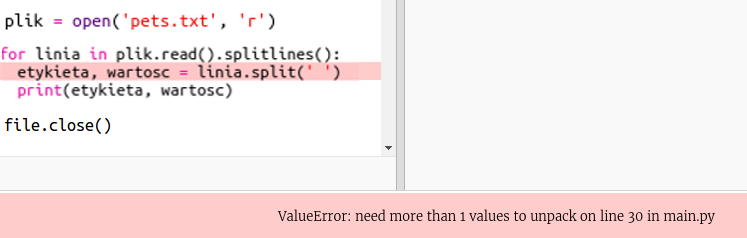
    
    Dzieje się tak, jeśli masz pusty wiersz na końcu pliku.
    
    Możesz naprawić błąd, pobierając etykietę i wartość tylko wtedy, gdy linia nie jest pusta.
    
    Aby to zrobić, wprowadź wcięcie kodu wewnątrz pętli `for` i dodaj kod, `if line:` powyżej niego:
    
    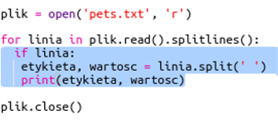

+ Możesz usunąć linię `print(label, value)`, teraz wszystko działa.

+ Teraz dodajmy etykietę i wartość do nowego wykresu kołowego i wyrenderujmy go:
    
    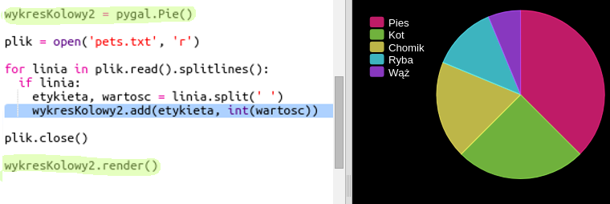
    
    Zauważ, że `add` oczekuje, że wartość będzie liczbą, `int (wartość)` zamienia wartość z ciągu znaków na liczbę całkowitą- integer.
    
    Jeśli chciałbyś używać liczb dziesiętnych, takich jak 3.5 (liczba zmiennoprzecinkowa), możesz zamiast tego użyć `float(wartość)`.

## Zapisz swój projekt {.save}

## Wyzwanie: Utwórz nowy wykres z pliku {.challenge}

Czy możesz utworzyć nowy wykres słupkowy lub wykres kołowy z danych w pliku? Musisz utworzyć nowy plik .txt.

Wskazówka: jeśli chcesz mieć spacje w etykietach, użyj `linii.split (":")` i dodaj dwukropki do pliku danych, np. "Rusałka admirał: 6"

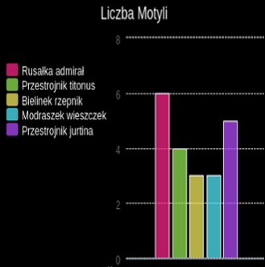

## Zapisz swój projekt {.save}

## Wyzwanie: więcej wykresów i grafów! {.challenge}

Czy możesz utworzyć wykres kołowy i wykres słupkowy z tego samego pliku? Możesz użyć danych zebranych wcześniej lub zebrać nowe dane.

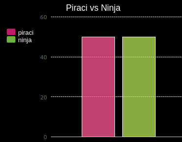

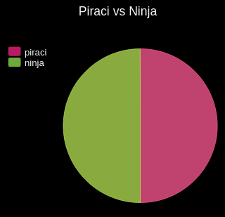

## Zapisz swój projekt {.save}