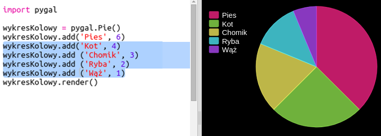

## Utwórz wykres kołowy

Wykresy kołowe to użyteczny sposób wyświetlania danych. Zrób ankietę ulubionych zwierzaków w twoim Code Clubie, a następnie przedstaw dane jako wykres kołowy.

+ Poproś lidera klubu, aby pomógł zorganizować ankietę. Możesz nagrywać wyniki na komputerze podłączonym do projektora lub tablicy, którą każdy może zobaczyć.
    
    Napisz listę zwierząt domowych i upewnij się, że wszyscy ulubieńcy są uwzględnieni.
    
    Następnie każ wszystkim głosować na swoich faworytów, podnosząc rękę, gdy zostanie wywołany. Tylko jeden głos każdy!
    
    Na przykład:
    
    

+ Otwórz pusty szablon Pythona Trinket: <a href="http://jumpto.cc/python-new" target="_blank">jumpto.cc/python-new</a>.

+ Stwórzmy wykres kołowy, aby pokazać wyniki Twojej ankiety. Będziesz używał biblioteki PyGal do wykonania ciężkiej pracy.
    
    Najpierw zaimportuj bibliotekę Pygal:
    
    

+ Teraz utwórz wykres kołowy i wyrenderuj (wyświetl) go:
    
    
    
    Nie martw się, robi się ciekawiej, gdy dodajesz dane!

+ Dodajmy dane dla jednego ze zwierząt. Wykorzystaj zebrane dane.
    
    
    
    Jest tylko jeden element danych, więc zajmuje cały wykres kołowy.

+ Teraz dodaj pozostałe dane w ten sam sposób.
    
    Na przykład:
    
    

+ Aby ukończyć wykres, dodaj tytuł:
    
    