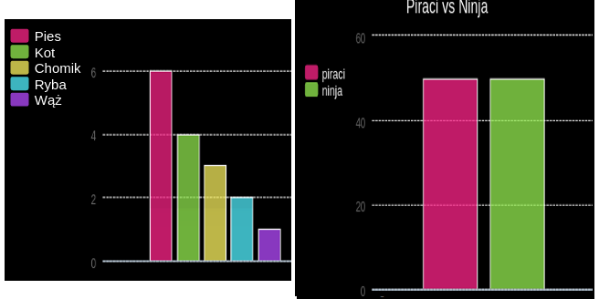

\--- wyzwanie \---

## Wyzwanie: Stwórz własny wykres słupkowy

Możesz tworzyć wykresy słupkowe w podobny sposób. Po prostu użyj `barchart = pygal.Bar ()` , aby utworzyć nową tabelę, a następnie dodaj dane i wyrenderuj w taki sam sposób, jak w przypadku wykresu kołowego.

Zbieraj dane od członków Code Club, aby stworzyć własny wykres słupkowy.

Upewnij się, że wybierasz temat, o którym wszyscy będą wiedzieć!

Oto kilka pomysłów:

+ Jaki jest Twój ulubiony sport?
+ Jaki jest twój ulubiony smak lodów?
+ Jak dostajesz się do szkoły?
+ W którym miesiącu są Twoje urodziny?
+ Czy grasz w Minecraft? (tak nie)

Nie zadawaj pytań, które dają dane osobowe, takie jak miejsce zamieszkania ludzi. Zapytaj swojego lidera klubu, jeśli nie jesteś tego pewien.

Przykłady:

\--- / wyzwanie \---