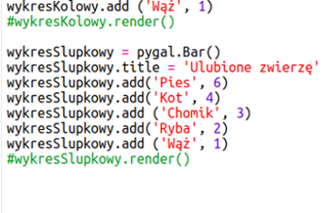

## Czytaj dane z pliku

Warto przechowywać dane w pliku, zamiast umieszczać je w kodzie.

+ Dodaj nowy plik do swojego projektu i zadzwoń do niego `pets.txt`:
    
    

+ Teraz dodaj dane do pliku. Możesz użyć zebranych danych ulubionych zwierząt lub danych przykładowych.
    
    

+ Przejdź z powrotem na `main.py` i skomentuj linie renderujące (wyświetlaj) wykresy (tak, aby nie były wyświetlane):
    
    

+ Teraz odczytajmy dane z pliku.
    
    
    
    Cyfra `dla` będzie pętla nad wierszami w pliku. `splitlines ()` usuwa znak nowego wiersza od końca wiersza, ponieważ tego nie chcesz.

+ Każda linia musi być podzielona na etykietę i wartość:
    
    
    
    Spowoduje to podzielenie linii na spacje, więc nie umieszczaj spacji na etykietach. (Możesz później dodać obsługę spacji w etykietach.)

+ Może pojawić się błąd podobny do tego:
    
    
    
    Dzieje się tak, jeśli masz pusty wiersz na końcu pliku.
    
    Możesz naprawić błąd, pobierając etykietę i wartość tylko wtedy, gdy linia nie jest pusta.
    
    Aby to zrobić, wprowadź wcięcie kodu wewnątrz `dla ciągu` i dodaj kod `, jeśli linia:` znajduje się powyżej:
    
    

+ You can remove the `print(label, value)` line now everything is working.

+ Teraz dodajmy etykietę i wartość do nowego wykresu kołowego i wyrenderujmy go:
    
    
    
    Zauważ, że `dodaje` oczekuje, że wartość będzie liczbą, `int (wartość)` zamienia wartość z ciągu na liczbę całkowitą.
    
    Jeśli chciałbyś używać liczb dziesiętnych, takich jak 3,5 (liczba zmiennoprzecinkowa), możesz zamiast tego użyć `float (wartość)`.