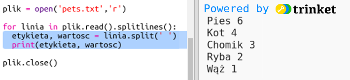
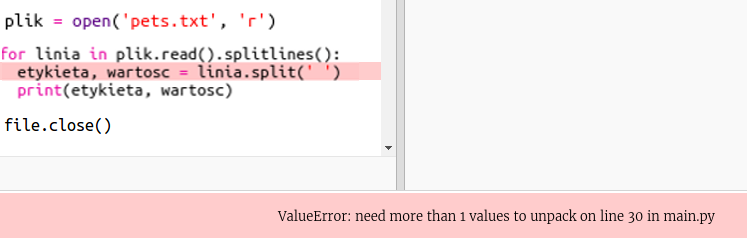
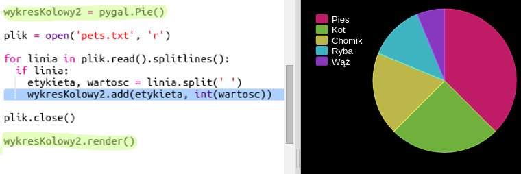

## Wczytaj dane z pliku

Warto przechowywać dane w pliku, zamiast umieszczać je w kodzie.

+ Dodaj nowy plik do projektu i nazwij go `pets.txt`:
    
    

+ Teraz dodaj dane do pliku. Możesz użyć zebranych danych ulubionych zwierząt lub danych przykładowych.
    
    

+ Przejdź z powrotem na `main.py` i zakomentuj linie renderujące (wyświetlające) wykresy (tak, aby nie były wyświetlane):
    
    

+ Teraz odczytajmy dane z pliku.
    
    
    
    Pętla `for` będzie powtarzać linie w pliku. `splitlines()` usuwa znak nowego wiersza z końca wiersza, ponieważ tego nie chcesz.

+ Każda linia musi być podzielona na etykietę(label) i wartość(value):
    
    
    
    Spowoduje to podzielenie linii spacjami, więc nie umieszczaj spacji na etykietach. (Możesz później dodać obsługę spacji w etykietach.)

+ Może pojawić się błąd podobny do tego:
    
    
    
    Dzieje się tak, jeśli masz pusty wiersz na końcu pliku.
    
    Możesz naprawić błąd, pobierając etykietę i wartość tylko wtedy, gdy linia nie jest pusta.
    
    Aby to zrobić, wprowadź wcięcie kodu wewnątrz pętli `for` i dodaj kod, `if line:` powyżej niego:
    
    

+ Możesz usunąć linię `print(label, value)`, teraz wszystko działa.

+ Teraz dodajmy etykietę i wartość do nowego wykresu kołowego i wyrenderujmy go:
    
    
    
    Zauważ, że `add` oczekuje, że wartość będzie liczbą, `int (wartość)` zamienia wartość z ciągu znaków na liczbę całkowitą- integer.
    
    Jeśli chciałbyś używać liczb dziesiętnych, takich jak 3.5 (liczba zmiennoprzecinkowa), możesz zamiast tego użyć `float (wartość)`.