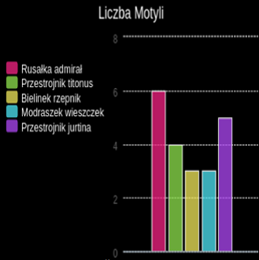

\--- wyzwanie \---

## Wyzwanie: Utwórz nowy wykres z pliku

Czy możesz utworzyć nowy wykres słupkowy lub wykres kołowy z danych w pliku? Musisz utworzyć nowy plik .txt.

Wskazówka: jeśli chcesz mieć spacje w etykietach, użyj `linii.split (":")` i dodaj dwukropki do pliku danych, np. "Red Admiral: 6"

\--- / wyzwanie \---