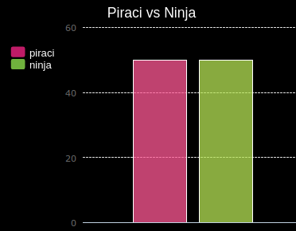

\--- wyzwanie \---

## Wyzwanie: więcej wykresów i wykresów!

Czy możesz utworzyć wykres kołowy i wykres słupkowy z tego samego pliku? Możesz użyć danych zebranych wcześniej lub zebrać nowe dane.

\--- / wyzwanie \---