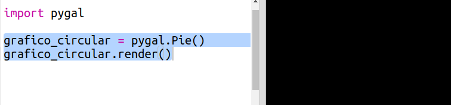
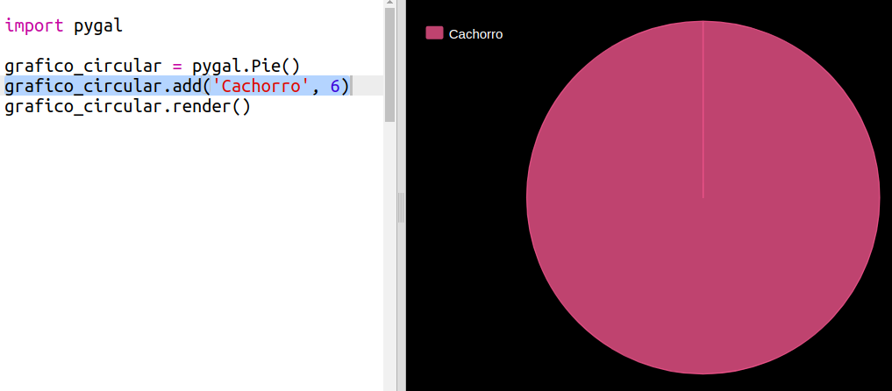
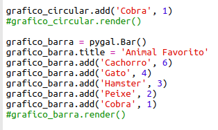
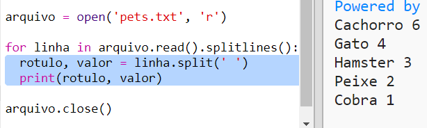

# Introdução {.intro}

Neste projeto, você cria gráficos de pizza e gráficos de barras a partir dos dados coletados dos membros do seu Code Club.

  <iframe src="https://trinket.io/embed/python/70d24d92b8?outputOnly=true&start=result" width="600" height="500" frameborder="0" marginwidth="0" marginheight="0" allowfullscreen>
  </iframe>
  

# Passo 1: Criar um gráfico de pizza {.activity}

Gráficos de pizza são uma forma útil de mostrar dados. Vamos fazer uma pesquisa com os animais favoritos no seu Code Club e então apresentar os dados como um gráfico de pizza.

## Lista de atividades {.check}

+ Peça ao seu voluntário para ajudar a organizar uma pesquisa. Você pode gravar os resultados em um computador conectado a um projetor ou quadro branco que todos possam ver.
    
    Escreva uma lista de animais de estimação e certifique-se de que os favoritos de todos estejam incluídos.
    
    Então faça com que todos votem em seu favorito colocando a mão para cima quando for chamado. Apenas um voto cada!
    
    Por exemplo:
    
    

+ Abra o modelo Trinket em branco do Python: <a href="http://jumpto.cc/python-new" target="_blank">jumpto.cc/python-new</a>.

+ Vamos criar um gráfico de pizza para mostrar os resultados da sua pesquisa. Você estará usando a biblioteca PyGal para fazer um pouco do trabalho pesado.
    
    Primeiro importe a biblioteca Pygal:
    
    

+ Agora vamos criar um gráfico de pizza e renderizar (exibir):
    
    
    
    Não se preocupe, fica mais interessante quando você adiciona dados!

+ Vamos adicionar os dados de um dos animais de estimação. Use os dados que você coletou.
    
    
    
    Há apenas um dado, então ele ocupa todo o gráfico de pizza.

+ Agora adicione o restante dos dados da mesma maneira.
    
    Por exemplo:
    
    

+ E para finalizar seu gráfico, adicione um título:
    
    

## Salve seu projeto {.save}

## Desafio: crie seu próprio gráfico de barras {.challenge}

Você pode criar gráficos de barras de maneira semelhante. Apenas use, `grafico_barra = pygal.Bar()` para criar um novo gráfico de barras, e então adicione os dados e renderize do mesmo jeito que para um gráfico de pizza.

Colete dados de seus membros do Code Club para criar seu próprio gráfico de barras.

Certifique-se de escolher um tópico que todos saibam!

Aqui estão algumas idéias:

+ Qual é o seu esporte favorito?

+ Qual é o seu sabor favorito de sorvete?

+ Como você chega na escola?

+ Qual é o mês do seu aniversário?

+ Você joga Minecraft? (sim/não)

Não faça perguntas que forneçam dados pessoais, como o endereço das pessoas. Pergunte ao líder do seu clube se não tiver certeza.

Exemplos:

## Salve seu projeto {.save}

# Passo 2: Ler dados de um arquivo {.activity}

É útil poder armazenar dados em um arquivo em vez de ter que incluí-los em seu código.

## Lista de atividades {.check}

+ Adicione um novo arquivo ao seu projeto e chame-o de `pets.txt`:
    
    

+ Agora adicione dados ao arquivo. Você pode usar os dados de animais de estimação favoritos que você coletou ou os dados de exemplo.
    
    

+ Volte para `main.py` e comente as linhas que renderizam (exibem) gráficos e gráficos (para que não sejam exibidos):
    
    

+ Agora vamos ler os dados do arquivo.
    
    
    
    O loop `for` fará um laço nas linhas do arquivo. `splitlines()` remove o caractere de nova linha ao final da linha, já que você não quer isso.

+ Cada linha precisa ser separada em um rótulo e um valor:
    
    
    
    Isso dividirá a linha nos espaços, portanto, não inclua espaços nos rótulos. (Você pode adicionar suporte para espaços em rótulos depois.)

+ Você pode receber um erro como este:
    
    
    
    Isso acontece se você tiver uma linha vazia no final do seu arquivo.
    
    Você pode corrigir o erro obtendo o rótulo e o valor apenas se a linha não estiver vazia.
    
    Para fazer isso, indente o código dentro do seu loop `for` e adicione o código `if linha:` acima:
    
    

+ Você pode remover a linha `print(rotulo, valor)` agora que está tudo funcionando.

+ Agora vamos adicionar o rótulo e o valor a um novo gráfico de pizza e renderizá-lo:
    
    
    
    Note que `add` espera que o valor seja um número, `int (valor)` transforma o valor de uma string em um inteiro.
    
    Se você quisesse usar decimais como 3.5 (números de ponto flutuante) você poderia usar `float (valor)`.

## Salve seu projeto {.save}

## Desafio: crie um novo gráfico a partir de um arquivo {.challenge}

Você consegue criar um gráfico de barras ou um gráfico de pizza a partir de dados em um arquivo? Você precisará criar um novo arquivo .txt.

Dica: Se você quiser espaços nos rótulos, use `linha.split (':')` e adicione dois pontos ao seu arquivo de dados, por exemplo, 'Red Admiral: 6'

## Salve seu projeto {.save}

## Desafio: Mais gráficos e tabelas! {.challenge}

Você consegue criar um gráfico de pizza e um gráfico de barras a partir do mesmo arquivo? Você pode usar os dados coletados anteriormente ou coletar novos dados.

## Salve seu projeto {.save}