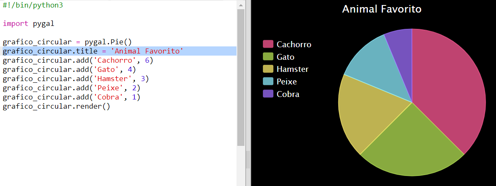
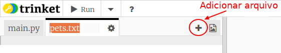
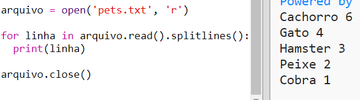

# Introdução {.intro}

Neste projeto, você cria gráficos de pizza e gráficos de barras a partir dos dados coletados dos membros do seu Code Club.

  <iframe src="https://trinket.io/embed/python/70d24d92b8?outputOnly=true&start=result" width="600" height="500" frameborder="0" marginwidth="0" marginheight="0" allowfullscreen>
  </iframe>
  

# Passo 1: Crie um gráfico de pizza {.activity}

Gráficos de pizza são uma forma útil de mostrar dados. Vamos fazer uma pesquisa com os animais favoritos no seu Code Club e depois apresentar os dados como um gráfico de pizza.

## Lista de atividades {.check}

+ Peça ao seu voluntário para ajudar a organizar uma pesquisa. Você pode gravar os resultados em um computador conectado a um projetor ou quadro branco que todos possam ver.
    
    Escreva uma lista de animais de estimação e certifique-se de que os favoritos de todos estejam incluídos.
    
    Then get everyone to vote for their favourite by putting their hand up when it gets called out. Only one vote each!
    
    Por exemplo:
    
    

+ Open the blank Python template Trinket: <a href="http://jumpto.cc/python-new" target="_blank">jumpto.cc/python-new</a>.

+ Vamos criar um gráfico de pizza para mostrar os resultados da sua pesquisa. Você usará a biblioteca PyGal para facilitar o trabalho.
    
    Primeiro importe a biblioteca Pygal:
    
    

+ Agora vamos criar um gráfico de pizza e renderizar (exibir):
    
    
    
    Não se preocupe, fica mais interessante quando você adiciona dados!

+ Vamos adicionar os dados de um dos animais de estimação. Use os dados que você coletou.
    
    
    
    Há apenas um dado, então ele ocupa todo o gráfico de pizza.

+ Agora adicione o restante dos dados da mesma maneira.
    
    Por exemplo:
    
    

+ Para finalizar seu gráfico, adicione um título:
    
    

## Salve seu projeto {.save}

## Desafio: crie seu próprio gráfico de barras {.challenge}

You can create bar charts in a similar way. Just use `barchart = pygal.Bar()` to create a new barchart, and then add data and render in the same way as for a pie chart.

Collect data from your Code Club members to create your own bar graph.

Make sure that you choose a topic that everyone will know about!

Aqui estão algumas idéias:

+ Qual é o seu esporte favorito?

+ Qual é o seu sabor favorito de sorvete?

+ How do you get to school?

+ Qual é o mês do seu aniversário?

+ Você joga Minecraft? (sim/não)

Não faça perguntas que forneçam dados pessoais, como o endereço das pessoas. Pergunte ao líder do seu clube se não tiver certeza.

Exemplos:

## Salve seu projeto {.save}

# Passo 2: Ler dados de um arquivo {.activity}

It's useful to be able to store data in a file rather than having to include it in your code.

## Lista de atividades {.check}

+ Adicione um novo arquivo ao seu projeto e chame-o de `pets.txt`:
    
    

+ Agora adicione dados ao arquivo. Você pode usar os dados de animais de estimação favoritos que você coletou ou os dados de exemplo.
    
    

+ Switch back to `main.py` and comment out the lines that render (display) charts and graphs (so that they aren't displayed):
    
    

+ Agora vamos ler os dados do arquivo.
    
    
    
    The `for` loop will loop over the lines in the file. `splitlines()` removes the newline character from the end of the line as you don't want that.

+ Each line needs to be separated into a label and a value:
    
    
    
    This will split the line at the spaces so don't include spaces in the labels. (You can add support for spaces in labels later.)

+ Você pode receber um erro como este:
    
    
    
    Isso acontece se você tiver uma linha vazia no final do seu arquivo.
    
    You can fix the error by only getting the label and value if the line isn't empty.
    
    To do this, indent the code inside your `for` loop and add the code `if line:` above it:
    
    

+ You can remove the `print(label, value)` line now everything is working.

+ Agora vamos adicionar o rótulo e o valor a um novo gráfico de pizza e renderizá-lo:
    
    
    
    Note that `add` expects the value to be a number, `int(value)` turns the value from a string into an integer.
    
    If you wanted to use decimals such as 3.5 (floating point numbers) you could use `float(value)` instead.

## Salve seu projeto {.save}

## Desafio: crie um novo gráfico a partir de um arquivo {.challenge}

Você consegue criar um gráfico de barras ou um gráfico de pizza a partir de dados em um arquivo? Você precisará criar um novo arquivo .txt.

Dica: Se você quiser espaços nos rótulos, use `linha.split (':')` e adicione dois pontos ao seu arquivo de dados, por exemplo, 'Red Admiral: 6'

## Salve seu projeto {.save}

## Desafio: Mais gráficos e tabelas! {.challenge}

Você consegue criar um gráfico de pizza e um gráfico de barras a partir do mesmo arquivo? Você pode usar os dados coletados anteriormente ou coletar novos dados.

## Salve seu projeto {.save}