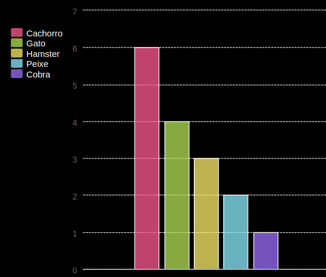

## Introdução

Neste projeto, você cria gráficos de pizza e gráficos de barras a partir dos dados coletados dos membros do seu Code Club.

### Instruções

Quando você clica em "Run" (executar, em inglês), os gráficos são gerados a partir dos dados usando o módulo python PyGal.

  <iframe src="https://trinket.io/embed/python/36a44f634a?outputOnly=true&start=result" width="600" height="500" frameborder="0" marginwidth="0" marginheight="0" allowfullscreen>
  </iframe>
  

### O que você vai aprender

Este projeto abrange elementos das seguintes vertentes do [Raspberry Pi Digital Making Curriculum](http://rpf.io/curriculum):

+ [Combinar as estruturas de programação para resolver um problema.](https://www.raspberrypi.org/curriculum/programming/builder/)

### Informações adicionais para educadores

Se você precisar imprimir este projeto, por favor, use a [versão para impressão](https://projects.raspberrypi.org/pt-BR/projects/popular-pets/print){:target="_blank"}.

Use o link no rodapé para acessar o repositório do GitHub para este projeto, que contém todos os recursos (incluindo um exemplo de projeto concluído) na pasta 'pt-BR/resources'.